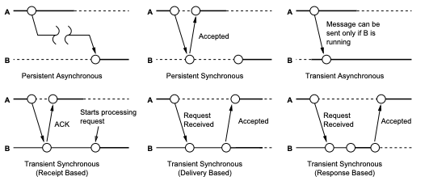
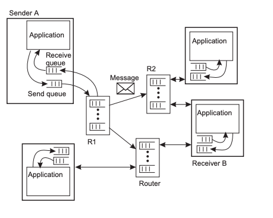
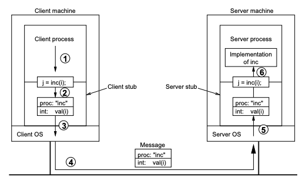

# Communication <!-- omit in toc -->

# Table of Contents <!-- omit in toc -->

- [Communication in a Distributed System](#communication-in-a-distributed-system)
  - [Communication Modes](#communication-modes)
    - [Data-oriented Communication](#data-oriented-communication)
    - [Control-oriented Communication](#control-oriented-communication)
  - [Communication Operations](#communication-operations)
    - [Synchronous Operation](#synchronous-operation)
    - [Asynchronous Operation](#asynchronous-operation)
  - [Terminology](#terminology)
- [Communication Abstractions](#communication-abstractions)
  - [Message-orientated Communication](#message-orientated-communication)
  - [Request-reply Communication](#request-reply-communication)
    - [RPC](#rpc)
    - [RMI](#rmi)
  - [Group-based Communication](#group-based-communication)
  - [Event-based Communication](#event-based-communication)
  - [Isochronous Communication](#isochronous-communication)

# Communication in a Distributed System

Computers don't have access to each other's memory - need to pass messages between each other to communicate.

_Message passing_: essentially send() and receive() functions.

Message passing provides synchronous/asynchronous communication & transient communication.
There is no buffer in send() or receive() to store messages.

_Coupling_: dependency between a sender and a receiver - used as a metric to assess distributed communication.

Types of coupling:

- _Temporal_
- _Spatial_
- _Semantic_ (content syntax)
- _Platform_

## Communication Modes

_Communication modes_: method of communicating

### Data-oriented Communication

_Data-oriented communication_: exchange data between nodes.

- Data or requests for data is sent in messages, no processing is done in other nodes.
- _E.g_ shared address spaces - communicate via sending addresses

### Control-oriented Communication

_Control-oriented communication_: transfers control with communication.

- Processing may be done somewhere else.
- Assumes receiver will go and do something.
- _E.g_ RPC

## Communication Operations

_Communication operations_: actions the sender/receiver does when a message is sent/received

### Synchronous Operation

_Synchronous operation_: both nodes must be active

- Sender blocks until a reply is received
- Receiver waits for requests, processes them, and returns them
- **Tight temporal coupling** - both parties need to be active
- **Tight spatial coupling** - both parties need to know about each other

### Asynchronous Operation

_Asynchronous operation_: sender does not block, the receiver does not have to be active

- Suitable when the sender can’t do any other tasks while waiting for the receiver to reply
- _E.g._ transferring money - want to block until you get a confirmation reply
- **Loose temporal coupling** - receiver does not have to be active
- **Tight spatial coupling** - both parties need to know about each other

Can make synchronous communication from asynchronous messages by:

1. Send an asynchronous send
2. Block until a message is received

Can make asynchronous communication from synchronous messages by:

1. Spawning a new thread
2. Sending a synchronous send/receive
3. Returning to the main thread when a message has been received

## Terminology

_Transient communication_: message is lost if the receiver does not accept it immediately

- **Tight temporal coupling**

_Persistent communication_: message is stored in a buffer if the receiver does not accept it immediately

- **Loose temporal coupling**

_Provider-initiated communication_: server sends message when available

- _E.g._ notifications

_Consumer-initiated communication_: client requests for data

- _E.g_. HTTP requests

_Direct-addressing_: message is sent to a specific receiver

- _E.g._ HTTP requests)
- **Tight spatial coupling**

_Indirect-addressing_: message is sent to anyone

- E.g. broadcast
- **Loose spatial coupling**

|  Combinations of Communication Types  |
| :-----------------------------------: |
|  |

# Communication Abstractions

_Communication abstractions_: implementations on top of message passing that make communication easier for the programmer.

## Message-orientated Communication

_Message-orientated communication_: communication that abstracts basic send() and receive().

- Doesn’t abstract the fact the communication is required, just the complexity of it
- Commonly used in middleware

On top of send() and receive(), it provides:

- Persistent communication (only for message queuing services)
- _Marshalling_
- Abstraction layer

_E.g._ Message passing interface (MPI) - transient communication library

- IBM MQSeries - persistent communication library
- Similar to email, but more general

|      Message Queuing Systems      |
| :-------------------------------: |
|  |

## Request-reply Communication

_Request-reply communication_: control-orientated communication with defined a message format and protocol

- **Tight semantic coupling**

### RPC

_RPC_ - execute a function on a remote node and send the reply back.

- Communication is abstracted from the application - looks like a local call
- Synchronous
- When client calls an RPC, it is passed into a stub, which sends it to the remote node stub, passing it up into the server function
- _Marshalling_ - stubs need to pack/unpack the data & flaten (serialise) pointers
- Server registers their functions to a binding service. When an RPC is called, it does a lookup in the binding service and forwards the function appropriately
- XML-RPC is a common example - encodes RPC calls in XML so it can be transferred over HTTP

|                RPC                |
| :-------------------------------: |
|  |

RPC stub for client:

```erlang
% Client code using RPC stub
client (Server) ->
    register(server, Server),
    Result = inc (10),
    io:format ("Result: ~w~n", [Result]).

% RPC stub for the increment server
inc (Value) ->
    server ! {self (), inc, Value},
    receive
        {From, inc, Reply} ->
            Reply
    end.
```

RPC stub for server:

```erlang
% increment implementation
inc (Value) ->
    Value + 1.

% RPC Server dispatch loop
server () ->
    receive
        {From, inc, Value} ->
            From ! {self(), inc, inc(Value)}
    end,
    server().
```

_Asynchronous RPC_: client blocks until server receives the RPC (i.e. sends an ACK)

- Boost performance, but becomes less transparent
- _E.g._ RPC doesn’t return - client should just wait until server sends an ACK and continue

_Deferred synchronous RPC_: client blocks until ACK, server interrupts client when message is ready

- Can think of it as two asynchronous RPCs
- _E.g._ client needs important network information, but not immediately - defer RPC call will interrupt client program once the server replies

### RMI

_RMI_ - invoke methods on remote objects

- Bind host information to object - no need for lookups through a binding service
- Can pass objects by reference - removes pointer problem in RPCs
- Encapsulate error handling and resource management in an object
- Less transparent than RPCs
- Transparency provided by RPCs and RMIs can be dangerous
- Need to handle errors specific to remote failures
- Arbitrary latency
- User interrupts do not carry over to a remote host
- Concurrency is difficult to track (e.g. errno)

## Group-based Communication

_Group-based communication_: send a message to a group of machines, instead of one

- Issues include message ordering and message reliability

_If one machine doesn’t receive a message, should it be resent to everyone?_

_Broadcast_: send a message to everyone on the network

_Multicast_: send a message to a specific group of machines

- _E.g._ gossip-based communication - good way of quickly spreading data
  - Node A tells asks all neighbours if it’s heard of message P
  - If neighbour hasn’t heard of it, store message P and spread message to other neighbours
  - If it has heard of it, stop broadcasting message

## Event-based Communication

_Event-based communication_: abstract senders and receivers into events

- Senders publish events, receivers subscribe to events
- Loose spatial and temporal coupling
- _E.g._ firefighter services subscribe to a fire event, when something is on fire and publishes a fire event, all firefighter services will be notified

## Isochronous Communication

_Isochronous communication_: communication that has a minimum and maximum receive time (e.g. streams - video and audio channels)

- Data itself has tight spatial and temporal coupled

_Token bucket model_: token is added every specified second, data is sent with a token

- If no token is available, data can’t be sent out; if no data is available, tokens aren’t generated
