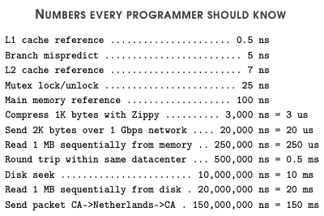

# Distributed Systems <!-- omit in toc -->

# Table of Contents <!-- omit in toc -->

- [Distributed Systems](#distributed-systems)
  - [Goals](#goals)
- [Distributed Algorithms](#distributed-algorithms)
  - [Synchronous Distributed Algorithms](#synchronous-distributed-algorithms)
  - [Asynchronous Distributed Algorithms](#asynchronous-distributed-algorithms)

# Distributed Systems

**Distributed system: a group of independent computers acting as one interface to its user**

Examples of distributed systems include:

- Systems that provide a single service or task - DNS, Netflix
- Interconnected distributed systems - Internet, IoT

Benefits:

- _Cost_: cheaper to horizontally scale (linear) than vertically scale (exponential)
- _Performance_: more absolute performance compared to a single computer
- _Scalability_: naturally grows as the demand grows
- _Reliability_: lots of redundant components, so the impact of faults can be reduced
- _Inherent distribution_: good for applications that are naturally distributed

Drawbacks:

- _Network component_: performance limit and unreliable - new points of failure
- _Complexity_: more complex system - greater chance of introducing errors
- _Partial failure_: can’t tell if a computer has crashed - won’t screw up the entire system but makes every node unreliable
- _Security_: more components to secure, therefore easier to compromise

## Goals

In every distributed system, we want:

1. _Transparency_: access, location, migration, replication, failure and concurrent transparency
2. _Dependability_: availability, reliability and maintenance
3. _Scalability_: size, geography and administration scalability
4. _Performance_
5. _Flexibility_: easy to add or remove components?

# Distributed Algorithms

_Distributed algorithms_: algorithms that are intended to work in a distributed (_asynchronous_ or _synchronous_) environment.
They are required by, or used to achieve synchronisation and coordination between nodes.

Factors that introduce uncontrollable randomness that makes creating distributed algorithms difficult:

- Process execution speed
- Clock drift
- Communication delays

Use key properties to assess distributed algorithms.
Every distributed algorithm should have:

- _Safety_: nothing bad should happen.
  I.e. an algorithm shouldn't have any side effects if it fails.
- _Liveness_: something good will eventually happen.
- _General properties_: desirable properties we want from any algorithm.
  - _Performance_: want high performance, so we want the minimum:
    - Number of messages exchanged
    - Delay (response/wait time)
    - Throughput (1/(delay + ExecutionTime))
    - Complexity
  - _Efficiency_: want a small amount of resource (memory, CPU) usage.
  - _Scalability_: avoid centralisation (central servers, algorithms, etc.)
  - _Reliability_: want minimal amount of points of failure

## Synchronous Distributed Algorithms

_Synchronous distributed algorithms_ have a **bounded time variance** - minimum and maximum time for clock drift, communication delay and execution speed.

Can use timeouts to detect failure.
The benefits and drawbacks of using synchronous distributed systems are:

| Benefits                                  | Drawbacks                                             |
| ----------------------------------------- | ----------------------------------------------------- |
| _Complexity_: algorithms are less complex | _Efficiency_: can't spawn lots of threads             |
|                                           | _Bandwidth_: must be low to meet time restriction     |
|                                           | _Clocks_: drift must be very low & synchronised often |

The major drawback is the **time restriction**.

## Asynchronous Distributed Algorithms

_Asynchronous distributed algorithms_ have an **unbounded time variance** - can't rely on timeouts to detect failure.
The benefits and drawbacks of using asynchronous distributed systems are:

| Benefits                                             | Drawbacks                                                       |
| ---------------------------------------------------- | --------------------------------------------------------------- |
| _Efficiency_: no restriction on threads              | _Complexity_: algorithms are more complex and are hard to solve |
| _Bandwidth_: no restriction on network communication |                                                                 |
| _Clocks_: no need to synchronise them                |                                                                 |
| _Synchronous solutions_                              |                                                                 |
