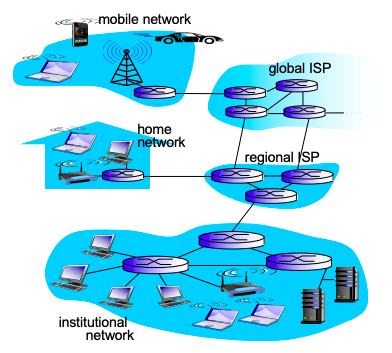
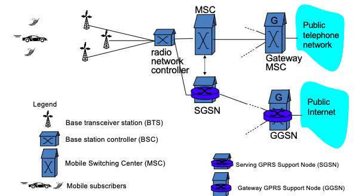
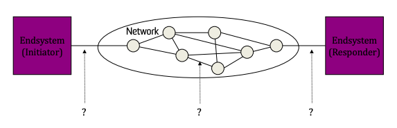

# Network Architectures and Security

## Network Architectures

|                   Internet Architecture                    |
| :--------------------------------------------------------: |
|  |

|                  Cellular Architecture                   |
| :------------------------------------------------------: |
|  |

## Network Vulnerabilities

- In a layered protocol architecture (such as the internet), an attack can happen at any interface

|  Security Analysis of Layered Protocol Architectures   |
| :----------------------------------------------------: |
|  |

- _Dolev-Yao (DY)_: formal model for security analysis
  - Doesn't capture real-world scenarios, such as social engineering

### Examples of Network Security Attacks

- _Man in the Middle_
- _\[Distributed\] Denial of Service_
- _IP Spoofing_: impersonating an authorised user by forging the IP address

## Desirable Security Properties

- _Confidentiality_
- _Authentication_: confirming the identity of each other
- _Message integrity_
- _Non-repudiation_: when no one can deny that the message was sent by the sender
- _Access and availibility_

- The difference between authentication non-repudiation is:
  - if authentication is compromised, only one protocol or account is compromised.
  - if non-repudiation is compromised, all your messages are compromised.

## Security in Different Networks: Overview

### Wireless Networks

- Wireless networks are more prone to eavesdropping
- No physical connection = easy access to router services
  - Easy for illegitimate access
- Authentication must be re-established when device moves
- Sacrificing location privacy for mobility - need to try and protect location information
- Bogus messages can be injected
- Replay attacks - passively picking up packets and resending them later is easy
- DOS via signal jamming - can only be stopped by making it illegal (i.e. no real way of stopping signal jamming)

### Cellular Networks

- 2G had weak security
  - Data integrity was not provided
- There have been some improvements
  - Message integrity is now provided

### Wifi (WLAN)

- Covered in depth soon

### Wireless Mesh Networks

- Verification issues
  - Each user has to be authenticated to the closest mesh router + its neighbours
  - Each mesh router has to be authenticated to its neighbours
  - Performing verifications must be lightweight

### Wireless Sensor Networks

- Large resource constraint - want to keep energy consumption down
  - Limits CPU power, so we need lightweight crypto protocols
- Lots of sensors that need physical security
- Wireless programming security risks

### Vehicle Ad-hoc Network (VANET)

- VANET: provides short range communication between cars
  - Autonomous vehicles require a lot more communication
- Mobility creates network/authentication problems
- Privacy is leaked when you move
- Can create bogus traffic information

### 802.15 Personal Area Network (PAN)

- 10m diameter signal range - makes eavesdropping more difficult (as well as frequency hopping)
- Frequency hopping - sender/recviever changes frequency often enough that an eavesdropper can't catch up
- Device authentication is difficult
