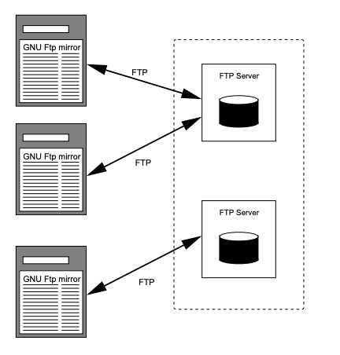

# Replication & Consistency

## Replication

It's a good idea to replicate services on multiple machines in distributed systems.
Why? There are three reasons:

- It improves _reliability_ - having redundant parts decreases the risk of one failed part screwing up your entire system.
- Replicating services means you have more processing power, hence increasing _performance_.
- Replication reduces the workload on individual servers, increasing _scalability_ in size.
  Replicating services in strategic geographical areas reduces network latency, and increases scalability in geography.

There are two forms of replication: data and control replication.

_Data replication_ involves either mirroring or caching data.
_Mirroring_ is where the disk storage is copied to other servers (for example, FTP server replication).

_Caching_ is where the data served is stored by intermediate nodes.
In general, the service providers control mirrored servers, and network providers and clients control caching.
Servers push updates to its mirrors, while caches pull updates from servers.

|            Mirroring            |           Caching           |
| :-----------------------------: | :-------------------------: |
|  |  |

_Control replication_ is horizontal scaling - replicating the services a machine provides.

**The biggest issue in replication is propagating updates.**
Reads and writes must be synchronised between nodes.

### Distributed Data Store

Distributed data stores use data replication to achieve high reliability, performance and scalability.
Each replica contains a _replica manager_ that is in charge of ensuring data consistency and propagating updates.

|      Distributed Data Store       |
| :-------------------------------: |
|  |

Clients will always be connected to one replica at a time.
A client will be able to do a read or write operation on the data store.
Operations are not instantaneous:

- _Time of issue_: when a client sends a request to the store.
- _Time of execution_: when a request is executed by a replica.
- _Time of completion_: when all replicas have been notified of the request and a reply is returned to the client.

## Consistency

Consistency requires two things:

- _Timing_: how old is the data allowed to be?
- _Operation Ordering_: in what order were operations performed?

Time consistency can be ensured through _versioning_.