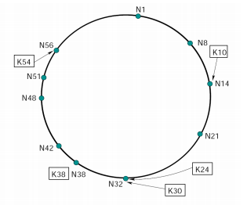
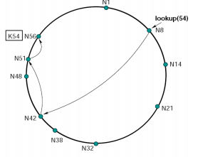
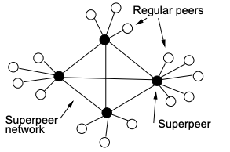
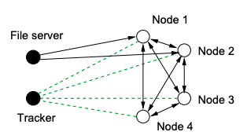
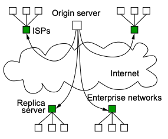
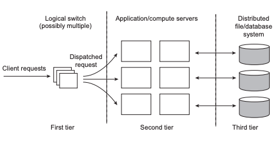
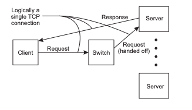

# System Architecture <!-- omit in toc -->

# Table of Contents <!-- omit in toc -->

- [Client-Server Architecture](#client-server-architecture)
  - [Erlang Example](#erlang-example)
- [Peer to Peer Architecture](#peer-to-peer-architecture)
  - [DHT Example: Chord DHT](#dht-example-chord-dht)
- [Hybrid Architectures](#hybrid-architectures)
  - [Superpeer Networks](#superpeer-networks)
  - [Collaborative Distributed Systems](#collaborative-distributed-systems)
  - [Edge-Server Systems](#edge-server-systems)
- [Process Architecture](#process-architecture)
- [Server Architecture](#server-architecture)
  - [Clustered Servers](#clustered-servers)
  - [Request Switching](#request-switching)

**System architecture: figuring out where to place machines and the servers on them.**

# Client-Server Architecture

_Client-server architecture_: clients send requests, servers reply with responses.

| Benefits                                        | Drawbacks                                                 |
| ----------------------------------------------- | --------------------------------------------------------- |
| _Complexity_: simple to implement               | _Scalability_: clients will always overload the server    |
| _Flexibility_: clients can connect/leave easily | _Dependability_: single point of failure                  |
|                                                 | _Performance_: server limits number of client connections |

The major drawback in this architecture is **scalability**.
There are ways to delay this from happening:

- _Vertical distribution (partitioning)_: split services onto different machines.
  - _E.g._ split the user interface, application and database onto three different machines
  - This increases performance, as more things can be parallelised
  - Ultimately, its still one machine
- _Horizontal distribution (replication)_: replicate the servers
  - _E.g._ copy the application to another machine so it can handle more requests at the same time
  - Improves:
    - _Scalability_: new servers will take the load off a single one
    - _Dependability_: no single point of failure at server
    - _Availability_: clients can choose a variety of servers to connect to
  - Network communication becomes a bottleneck
  - Ultimately faces the same issues as a distributed system (consistency, concurrency, etc.)

|              Vertical Distribution              |               Horizontal Distribution               |
| :---------------------------------------------: | :-------------------------------------------------: |
|  |  |

Both horizontal distribution and vertical distribution are examples of horizontal scaling.

Combining vertical and horizontal distribution makes the client-server architecture practically scalable.

## Erlang Example

```erlang
%% Client to contact the server
%% Server is the Pid of the server
client (Server) ->
    Server ! {self (), 10},
    receive
        {From, Reply} ->
            io:format ("Result: ~w~n", [Reply])
    end.

%% Server loop
loop () ->
    receive
        {From, Msg} ->
            From ! {self (), Msg + 1},
            loop ();
        stop ->
            true;
        _ ->
            ignore;
    end.

%% Initiate the server
start_server() ->
    spawn(
        fun () ->
            loop ()
        end
    ).
```

# Peer to Peer Architecture

_Peer To Peer Architecture_: all processes are clients and servers - creates a decentralised system.

Benefits and drawbacks of P2P:

| Benefits                                           | Drawbacks                                              |
| -------------------------------------------------- | ------------------------------------------------------ |
| _Scalability_: difficult to overload a single peer | _Flexibility_: joining or leaving is complicated       |
|                                                    | _Performance_: difficult to achieve because of routing |
|                                                    | _Dependability_: difficult & unreliable to find peers  |

The major drawback in this architecture is **membership/routing**.

There are two ways to keep track of peers:

- _Static structure_: peers are predefined, but you can never join or leave.
- _Dynamic structure_: dynamically track peers via an _overlay network_ (a network built on top of another network).
  - Application must define addressing, routing and any special features from scratch
    - This is because a new network must be built on top of the existing network (usually TCP/IP)
  - Joining is difficult as you need to find a node in the underlying network's address (i.e. IP address) first
    - Can brute force IP addresses until successful

The structure of an overlay network dictates what neighbours a peer will have once it connects to the network.
There are two ways to structure an overlay network:

- _Unstructured overlay_: peers have a partial view (list of neighbours), which are exchanged to update reachable peers
  - No algorithm to determine neighbours involved
  - Hard to route to a peer you've never heard of before
  - Peers are always added or removed - hard to remain consistent
  - Sacrifices _performance_ for _flexibility_
  - _E.g._ Winny network or Gnutella
- _Structured overlay_: an algorithm is used to determine a peer's neighbours
  - Structure reduces latency because routing is easier
  - Sacrifices _flexibility_ for _performance_
  - _E.g._ a distributed hash table - each node is responsible for the data that hashes to it

|            Unstructured Overlay Network            |      Distributed Hash Table      |
| :------------------------------------------------: | :------------------------------: |
|  |  |

## DHT Example: Chord DHT

_Distributed hash table_: a hash table as an overlay network.
DHT is good for unstructured lookups (i.e. if the content have no structure, using a DHT is good).
In the worst case, a lookup is $$O(N)$$ - lookup on every node and only the last node is successful.

_Chord_: is a simple lookup protocol that implements a DHT.
On average, lookups are $$O(log(N))$$.

|                Chord                 |
| :----------------------------------: |
|  |

In order to work, Chord needs a predefined constant, _$$m$$_, that all peers are assumed to know.
_$$m$$_ is the maximum number of peers that can join the network.
Ideally the number of peers that actually join the network should be $$\ll m$$.

Chord uses _consistent hashing_ to create identifiers for both peers and files:

1. Generate the SHA1 hash of the IP address or filename.
   This forms a 160 bit string.
2. The string is truncated to _m_ bits, creating an identifier between $$0...2^m-1$$.

Consistent hashing provides load balancing across all peers.
On average, a peer stores $$O(K/N)$$ files, where $$K$$ is the total number of files and $$N$$ is the total number of peers in the network.

Each peer has a _successor_ (clockwise neighbour) and _predecessor_ (anticlockwise neighbour).
All peers are required to maintain a _finger table_.
A finger table keeps track of successors with $$id \simeq n + 2^{i-1} \ for \ i \in 1...m-1$$.

A separate thread or process must be working in the background to query if successors are still active and update the finger table accordingly.

To lookup a file:

1. Go to the finger table entry $$\lt$$ the key.
2. Check if the file is on the local machine.
3. If it isn't, go to next finger table entry.
4. Repeat as a recursive RPC until key is found.
   If it isn't found, the data has been lost.

|              Chord Lookup              |
| :------------------------------------: |
|  |

To add a file:

1. Generate the file identifier (key) via consistent hashing.
2. Route to where the file should be and insert into the corresponding peer.
3. It is generally a good idea to replicate the file at the successor and predecessor.

To add a peer:

1. Copy the finger table of the new peer's successor.
2. `stabilise()` the network by redistributing the keys.
3. `fix_fingers()` to update finger tables on all peers.

If a peer leaves:

- Replicate all keys at the successor and predecessor
- `stabilise()` and `fix_fingers()`.

- Peers keep track of its successor - the IP and port number of the peer ahead of it in the ring
- Also keeps track of and stores peers with id closest clockwise to n+2^i(mod 2^m) for i=0..m-1 --> called _finger tables_
  - Provides O(logN) time
  - Only true if successors are correct

# Hybrid Architectures

_Hybrid Architecture_: a combination of client-server and P2P architecture.
They try to bring the benefits of both architectures and minimise the drawbacks.

## Superpeer Networks

_Superpeer Networks_: superpeers serve regular peers, but are also peers amongst themselves.
_E.g._ the old Skype used superpeers.

| Benefits                                                 | Drawbacks                                                |
| -------------------------------------------------------- | -------------------------------------------------------- |
| _Scalability_: superpeers are geographically distributed | _Performance_: superpeers need to maintain a large index |
| _Flexibility_: normal peers can join/leave easily        | _Dependability_: single point of failure at superpeers   |

|              Superpeer Network               |
| :------------------------------------------: |
|  |

## Collaborative Distributed Systems

_Collaborative Distributed Systems_: download chunks of file from file server and nodes, managed by a tracker.
_E.g._ BitTorrent.

| Benefits                                   | Drawbacks                                           |
| ------------------------------------------ | --------------------------------------------------- |
| _Scalability_: peers can be from anywhere  | _Performance_: finding peers may take a while       |
| _Flexibility_: peers can join/leave easily | _Dependability_: single point of failure at tracker |
|                                            | _Security_: no authentication security              |

The dependability drawback is mitigated by implementing the tracker as a DHT.

|          Collaborative Distributed Systems           |
| :--------------------------------------------------: |
|  |

## Edge-Server Systems

_Edge-Server Systems_: replication service (CDN) at network edge.
_E.g._ Akamai, CloudFront, CoralCDN

| Benefits                                                             | Drawbacks                                                              |
| -------------------------------------------------------------------- | ---------------------------------------------------------------------- |
| _Scalability_: can easily add/remove replicas                        | _Dependability_: can only replicate content that is unlikely to change |
| _Flexibility_: replicas are created with demand                      |                                                                        |
| _Performance_: improved client performance as content is at the edge |                                                                        |

|       Edge-Server Systems        |
| :------------------------------: |
|  |

# Process Architecture

There are three main process architectures:

| Architecture         | Characteristics                        |
| -------------------- | -------------------------------------- |
| Single-threaded      | No parallelism, blocking system calls  |
| Threads              | Parallelism, blocking system calls     |
| Finite-state Machine | Parallelism, non-blocking system calls |

A process can be either:

- _Stateful_: keeps permanent information on clients
  - Expensive crash recovery - client must sync up again when the process crashes
  - Memory is used to track clients
- _Stateless_: does not keep persistent information on client
  - Process can keep session state
  - Can change location or restart without informing clients
  - No cleanup required - the process can replicate and move to a new machine
  - Increased average message size

# Server Architecture

## Clustered Servers

_Clustered servers_: client request goes through a _dispatcher_, which forwards the request to a server replica.
This reduces the load on any one replica, but increases the load on the dispatcher.

|              Clustered Servers               |
| :------------------------------------------: |
|  |

## Request Switching

_Request switching_: switch decides which replica to route the client request to.

Usually a request is sent on a round robin to each replica.
Instead of creating a single point of failure at the dispatcher (in clustered servers), switch is implemented by client application or DNS.
This increases dependability, flexibility and scalability.

|              Request Switching               |
| :------------------------------------------: |
|  |
