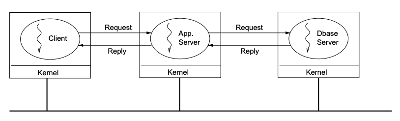
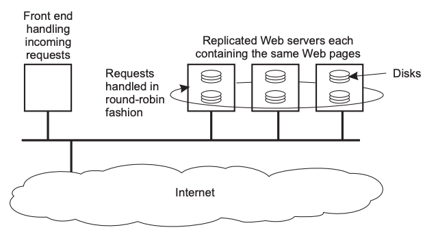
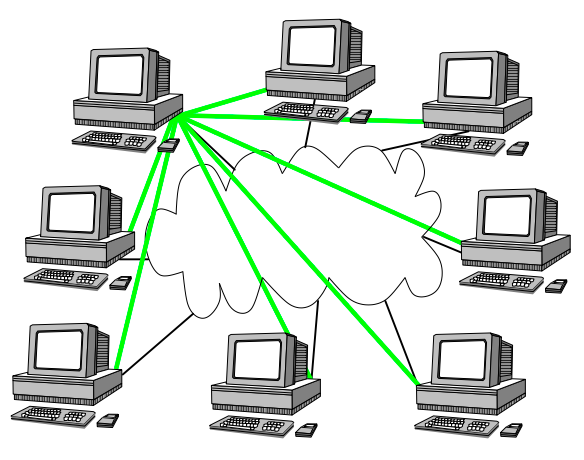
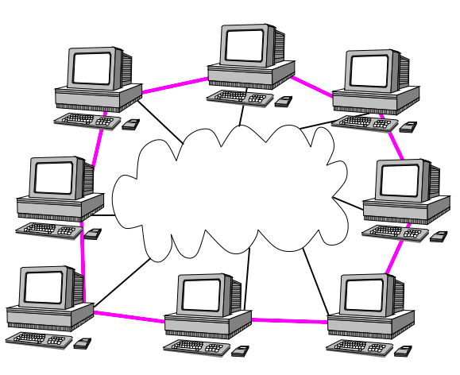
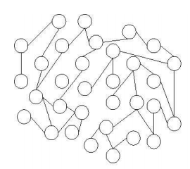
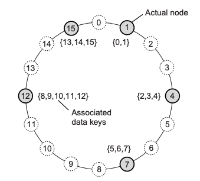

# System Architecture <!-- omit in toc -->

## Table of Contents <!-- omit in toc -->

- [Client-Server Architecture](#client-server-architecture)
  - [Erlang Example](#erlang-example)
- [Peer to Peer Architecture](#peer-to-peer-architecture)
  - [Distributed Hash Tables](#distributed-hash-tables)
  - [Example: Chord Lookup Protocol](#example-chord-lookup-protocol)
- [Hybrid Architectures](#hybrid-architectures)

**System architecture: figuring out where to place machines and the servers on them.**

## Client-Server Architecture

_Client-server architecture_: clients send requests, servers reply with responses.

| Benefits                          | Drawbacks                                                 |
| --------------------------------- | --------------------------------------------------------- |
| _Complexity_: simple to implement | _Scalability_: clients will always overload the server    |
|                                   | _Performance_: server limits number of client connections |
|                                   | _Flexibility_: can't add or remove a server easily        |
|                                   | _Dependability_: single point of failure                  |

The major drawback in this architecture is **scalability**.
There are ways to delay this from happening:

- _Vertical distribution (partitioning)_: split services onto different machines.
  - _E.g._ split the user interface, application and database onto three different machines
  - This increases performance, as more things can be parallelised
  - Ultimately, its still one machine
- _Horizontal distribution (replication)_: replicate the servers
  - _E.g._ copy the application to another machine so it can handle more requests at the same time
  - Improves:
    - _Scalability_: new servers will take the load off a single one
    - _Dependability_: no single point of failure at server
    - _Availability_: clients can choose a variety of servers to connect to
  - Network communication becomes a bottleneck
  - Ultimately faces the same issues as a distributed system (consistency, concurrency, etc.)

|              Vertical Distribution              |               Horizontal Distribution               |
| :---------------------------------------------: | :-------------------------------------------------: |
|  |  |

Both horizontal distribution and vertical distribution are examples of horizontal scaling.

Combining vertical and horizontal distribution makes the client-server architecture practically scalable.

### Erlang Example

```erlang
%% Client to contact the server
%% Server is the Pid of the server
client (Server) ->
    Server ! {self (), 10},
    receive
        {From, Reply} ->
            io:format ("Result: ~w~n", [Reply])
    end.

%% Server loop
loop () ->
    receive
        {From, Msg} ->
            From ! {self (), Msg + 1},
            loop ();
        stop ->
            true;
        _ ->
            ignore;
    end.

% Initiate the server
start_server() ->
    spawn(
        fun () ->
            loop ()
        end
    ).
```

## Peer to Peer Architecture

_Peer To Peer Architecture_: all processes are clients and servers - creates a decentralised system.

Benefits and drawbacks of P2P:

| Benefits                                           | Drawbacks                                              |
| -------------------------------------------------- | ------------------------------------------------------ |
| _Scalability_: difficult to overload a single peer | _Membership/Routing_: keeping track of peers           |
| _Flexibility_: can easily add or remove peers      | _Performance_: difficult to achieve because of routing |
|                                                    | _Dependability_: difficult & unreliable to find peers  |

The major drawback in this architecture is **membership/routing**.

There are two ways to keep track of peers:

- _Static structure_: peers are predefined, but you can never join or leave.
- _Dynamic structure_: dynamically track peers via an _overlay network_ (a network built on top of another network).
  - Application must define addressing, routing and any special features from scratch
    - This is because a new network must be built on top of the existing network (usually TCP/IP)
  - Joining is difficult as you need to find a node in the underlying network's address (i.e. IP address) first
    - Can brute force IP addresses until successful

|                        Examples of Different Overlay Networks                         |
| :-----------------------------------------------------------------------------------: |
|   |

The structure of an overlay network dictates what neighbours a peer will have once it connects to the network.
There are two ways to structure an overlay network:

- _Unstructured overlay_: peers have a partial view (list of neighbours), which are exchanged to update reachable peers
  - No algorithm to determine neighbours involved
  - Hard to route to a peer you've never heard of before
  - Peers are always added or removed - hard to remain consistent
  - Sacrifices _performance_ for _flexibility_
  - _E.g._: a Winny network
- _Structured overlay_: an algorithm is used to determine a peer's neighbours
  - Message passing takes a long time due to the defined structure
  - Sacrifices _flexibility_ for _performance_
  - _E.g._: a distributed hash table - each node is responsible for the data that hashes to it

|            Unstructured Overlay Network            |      Distributed Hash Table      |
| :------------------------------------------------: | :------------------------------: |
|  |  |

### Distributed Hash Tables

_Distributed hash table_: a hash table as an overlay network.

### Example: Chord Lookup Protocol

- Supports one operation: given a key, map it to a node
- Consistent distribution achieved by using a consistent hash (i.e. SHA1)
- A node's identifier is its IP address hashed
- Uses rules to decide who its neighbours are

## Hybrid Architectures
