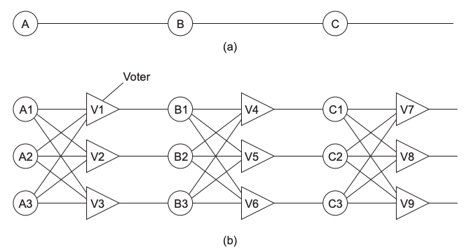
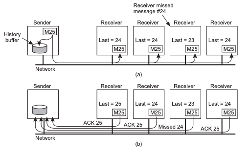

# Fault Tolerance <!-- omit in toc -->

- [Failure](#failure)
  - [Case Study: AWS Failure 2011](#case-study-aws-failure-2011)
  - [Failures and Faults](#failures-and-faults)
  - [Failure Models](#failure-models)
  - [Detecting Failure](#detecting-failure)
  - [Fault Tolerance](#fault-tolerance)
- [Reliable Communication](#reliable-communication)
  - [Reliable Multicast](#reliable-multicast)
- [Process resilience](#process-resilience)
- [Recovery](#recovery)

## Failure

Usually want distributed systems to be _dependable_.
In other words, it needs to handle servers failures and faults well.
The properties of a dependable distributed system are:

- _Availability_: probability the system can be used at any given moment.
  For example, AWS has 99.9% availability, meaning the service will have around 15min of downtime per year.
- _Reliability_: system can run for a long time without failure.
  Usually measured in Mean Time Between Failures (MTBF).
  A system with high availability but low reliability means it is easy to connect to, but crashes often.
  A system with low availability but high reliability means it is hard to connect to, but never crashes.
- _Safety_: if something in the system fails to operate correctly, nothing bad happens.
- _Maintainability_: how easily a failed system can be repaired.
  This includes automatic recovery.

### Case Study: AWS Failure 2011

- AWS failure - fault tolerance mechanisms made everything worse and crashed the entire system
- Network config error - primary network was redirected to secondary network
- Nodes couldn’t find it’s mirrors (replicas)
- Volumes were blocked because you couldn’t re-mirror - disk space had run out + secondary network was saturated
- Control plane server had thread starvation (no threads active) → took down other AZs
- Potential fixes: make the CPs availability zone aware, decrease timeout length

### Failures and Faults

Terminology:

- _Failure_: when a system cannot provide its services in a specified manner.
- _Error_: the **part of the system** which lead to a failure.
- _Fault_: the **cause of the error**.

A fault for one part of the system can be a failure for another part.
For example:

- A manufacturing _fault_ can lead to a disk _failure_.
- A disk _fault_ can lead to a database _failure_.
- A database _fault_ can lead to a email service _failure_.

_Total failure_ is when the entire system fails.
This is seen more in nondistributed systems.
_Partial failure_ is when a part of the system fails.
Although some parts of the system are unaffected, it is considered as a _fault_ of the whole system.

There are three types of faults:

- _Transient fault_: occurs once, and then disappears.
  For example, a message being lost on the network.
- _Intermittent fault_: happens, then vanishes, then appears again.
  These are often cause by indeterministic events, such as race conditions.
- _Permanent fault_: persists until the error is fixed or replaced.
  For example, software bugs or faulty hardware.

There are many different types of failures:

- _System failure_: a node goes down due to a software fault (usually an OS fault).
  Can recover from these failures by restarting the node, but it may lead to the same problem again.
- _Process failure_: process either proceeds incorrectly or not at all.
  The process can proceed incorrectly due to a bug.
  The process can halt due to live locking or deadlocking.
- _Storage failure_: hard disk storage has become inaccessible.
  Usually because of a hardware bug - needs physical replacement.
  Can recover from these bugs by rebuilding the data from archives and logs.
- _Communication failure_: the network (either a link or a node) has failed.
  This can lead to a network partition.

### Failure Models

_Failure model_: a model to determine how a component in a distributed system failed.
By determining the failure model, you can decide how to recover from the failure, if possible.

_Crash failure_: a server works correctly, and then halts.

- _Fail-stop_: clients are able to detect the server has failed.
- _Fail-resume_: server stops, then resumes execution at a later time.
- _Fail-silent_: client is not notified that the server has failed.

_Omission failure_: a server fails to respond to an incoming message or request.

- _Receive omission_: the server failed to receive incoming messages.
- _Send omission_: the server failed to send responses.

_Response failure_: the response a server sends is incorrect.

- _Value failure_: the value the server sends is incorrect.
- _State transition failure_: the server doesn't transition to a valid state (according to the state control flow).

_Timing failure_: the server responds to the client after a timeout has occurred.
This is different to an omission failure, as the server does send a response, but it is not received before the client timeout occurs.

_Arbitrary failure_: system goes into the worst possible state - server sends arbitrary messages at arbitrary times.
Also known as a _Byzantine failure_.

### Detecting Failure

_Failure detector_: a service that queries processes to determine if it has failed.
Failure detectors can be reliable or unreliable.
Can never determine with certainty that a node has failed, it can only be _unsuspected_.
If the query to a node returns, the detector will know that the process hasn't failed by the time the message is sent - hence the _unsuspected_ state.

If a detector is reliable, it can determine if a process has either _failed_ or is _unsuspected_.
If a detector is unreliable, it can determine if a process is either _suspected_ or _unsuspected_ to have failed.

In a synchronous system, the detector can send probes to detect crash failures with timeouts.
This is generally a reliable way to detect failure.
In an asynchronous system, the detector can't rely on timeouts and is therefore unreliable.
Can combine multiple _suspected_ results to give a stronger overall result.
Can't determine the difference between a communication failure and process failure in this sort of system.

It's possible to ignore messages from a _suspected_ process.
The process can restart and send a new message to neighbour nodes.
The neighbour nodes can add it back to the network again.

### Fault Tolerance

_Fault tolerance_: the system can provide its service, even in the presence of faults.
The ultimate goal is to handle partial failure without affecting the overall performance.
This would involve minimise the effect a failure has on other nodes.
Techniques used to provide fault tolerance:

- _Prevention_: make sure faults don't happen.
  Can be achieved by creating quality software or buying quality hardware.
  Not the most effective technique, a fault will always happen!
- _Prediction_: deal with faults you expect to happen.
  For example, using error handling and checksums to deal with process failure and communication failure respectively.
- _Masking_: try and hide the occurrence of a failure to other processes.
  Usually achieved by _redundancy_.
  There are three types of redundancy that can be used:
  - _Information redundancy_: replicating the storage on a machine.
  - _Time redundancy_: using _idempotent_ functions (functions that can be called many times and the result will not change).
    Can also utilise checkpoints.
  - _Physical redundancy_: physically replicating more machines.
- _Recovery_: rollback to an error-less state.

|                Redundancy Example                 |
| :-----------------------------------------------: |
|  |

Physical redundancy is shown in this example via _Triple Modular Redundancy_.
Three processes compute the same action _A_.
Then the voters _V_ take the answer with the majority vote and store the result.
If one process fails, the voters will still take the correct answer, thereby masking the failed process.

## Reliable Communication

Communication through the network is always going to be _lossy_.
Trying to prevent communication failures is not worth it.
Want to minimise omission failures (by prediction) and masking them.

Use a reliable transport protocol (i.e. TCP) to create reliable E2E communication.
TCP doesn't solve lossy communication though, it only masks omission failures.
Servers are still prone to crash failures if they use TCP.

### Reliable Multicast

_Reliable multicast_: multicast a message with a SeqNo attached to it.
All nodes reply with an ACK of the last message received.
If a node replies with an ACK that is not equal to the last sent SeqNo, the server sends the missing message(s) to the node directly.

|               Reliable Multicast                |
| :---------------------------------------------: |
|  |

Reliable multicast is prone to _feedback implosion_, where the server receives so many ACKs, it crashes.
This can be solved by sending a NACK instead.
Server load can be reduced further by sending a multicast NACK to all other nodes.
However, the system has to deal with another multicast (essentially nested multicast), and nodes who received the message successfully will be unnecessarily interrupted.

## Process resilience

_Process resilience_: protection from process failure.

- Have resilience in groups → copies of the same process running on different machines
- Need 2k+1 replicas for byzantine failures, as the components can lie about their state, and in the worst case, agree about lying about their state
- Majority of replicas have the same value
- Non-determinism for replicated state machines:
- Time - If the machine requires time, you can get slightly different states
- Side effects - something else running on the machine may change the memory
- E.g. I/O - taking a longer time to read from disk, etc.
- Atomic multicast - either message is received by all group members, or none
- Challenge is deciding who is in the group
- Need to see view change (group membership changes) and messages in the same order as everyone else (total order), otherwise the group will be out of synch
- Agreement - is very difficult

## Recovery
