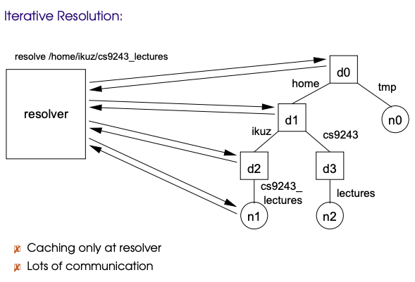
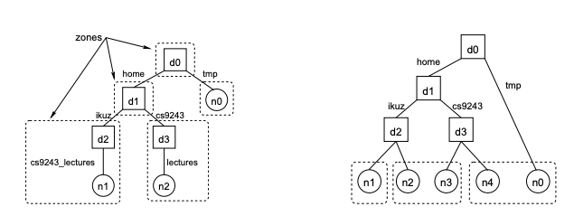
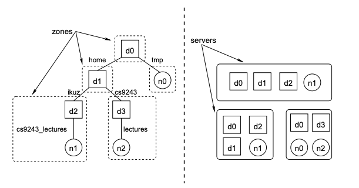
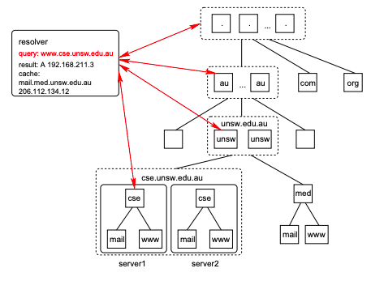
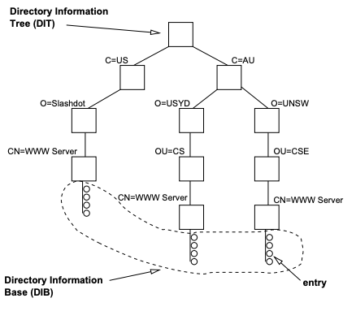
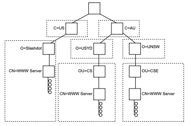
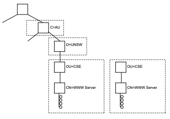
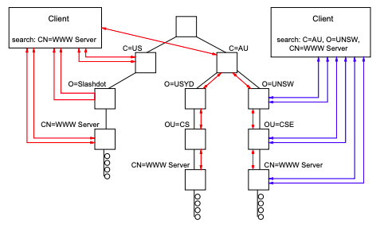

# Naming <!-- omit in toc -->

# Table of Contents <!-- omit in toc -->

- [Basic Concepts](#basic-concepts)
  - [Terminology](#terminology)
- [Name Spaces](#name-spaces)
  - [Hierarchical Name Space](#hierarchical-name-space)
    - [Merging Name Spaces](#merging-name-spaces)
  - [Name Resolution](#name-resolution)
- [Naming Services](#naming-services)
  - [Partitioning](#partitioning)
  - [Replication](#replication)
  - [Caching](#caching)
  - [Example: DNS](#example-dns)
- [Attribute Based Naming](#attribute-based-naming)
  - [Directory Services](#directory-services)
    - [Searching and Lookup](#searching-and-lookup)
  - [Example: X.500 and LDAP](#example-x500-and-ldap)
  - [Unstructured Names](#unstructured-names)
    - [Example: ARP](#example-arp)

# Basic Concepts

_Naming_ is used to identify _entities_ in systems.
An example of this is the Unix file system - it treats all entities as a file, names them accordingly and allows access through the file interface.
The difficult parts of naming include:

- _Collisions_: having the same name on different devices becomes a problem.
  Need to implement a global system to name entities.
- _Lookups_: once an entity is named, how do you find it?

## Terminology

- _Entity_: a resource, user or process in the system.
- _Name_: a string of bits or characters that refer to an identity.
- _Access point_: a location where operations on an entity can be performed.
- _Address_: the name of the access point.
  A single entity can have multiple addresses.
  The set of addresses an entity has can change (i.e. be added or lost).

|         Naming Terms         |
| :--------------------------: |
|  |

- _Pure name_: a name that does not encode any entity attributes in it.
  For example, a MAC address is a pure name, as it does not provide any information on where it can be found on the network.
- _Nonpure name_: a name that does encode entity attributes.
  For example, an IP address is a pure name, as it does provide information on where it can be found.

- _Identifier_: a name that uniquely refers to an entity.
  An entity can have one identifier, and an identifier can refer to one entity.
  It can never be reused.
  This allows for easy comparison of two entities - if they have the same identifier, they are the same entity.
- _Pure identifier_: a pure name that is also an identifier.
- _Location independent identifier_: an identifier that does not change if the entity is moved.
  It follows that a pure identifier is also a location independent identifier (but not the other way round).
- _Alias_: another name for an entity.

- _Human-orientated names_: variable length character strings.
  - Ideally pure and are often not identifiers (for example, symbolic links).
  - Often chosen for their mnemonic value.
  - Often have a structure to them.
  - Hard for machines to process, easy for humans to remember.
    Therefore, it is referred to once to get the system-orientated name, which is used from then on.
  - _Example_: a URL
- _System-orientated names_: fixed size numeral (machine-readable).
  - Ideally nonpure to speed up access time and manipulation.
  - Typically _structured_ or _unstructured_ identifiers, depending on if they are referenced in a global or local scope.
    A structured identifier is not pure.
  - To create a globally unique name, you can have either a _global generator_ (which is bad for scalability), or a structured name.
    An example of a structured name could be combining the local time and a unique machine identifier.
  - _Example_: an inode

# Name Spaces

_Name space_: a group of names which follow the same naming scheme.
All name spaces have a _leaf node_, which represents a named entity and may refer to either the entity itself or the address of it.

Name spaces can have different structures, including:

- _Flat_: name space contains only leaf nodes.
  For example, protocol name spaces (e.g. TCP, IP, ...).
- _Hierarchical_: strict, DAGs or multiple root nodes.
  This structure is commonly used because it is scalable.
- _Tag-based_

## Hierarchical Name Space

In a hierarchical name space, a leaf node has only incoming edges.
Furthermore, there are two more types of nodes used:

- _Directory node_: (aka _context_) stores information on a collection of other directory nodes or leaf nodes.
  The information is stored in a _directory table_.
  An entry to the table looks like: _(node -- id, edge -- label)_, meaning a node with _id_ can be found with along the edge named _label_.
  A directory node can have both incoming and outgoing edges.
- _Root node_: a directory node that has only outgoing edges.

A _strictly hierarchical name space_ has only one incoming edge for each node, while a _DAG_ name space can have multiple incoming edges and multiple root nodes.
A DAG has two additional types of links:

- _Hard link_: a second (or more) path that leads to an entity.
- _Soft link_: a leaf node that contains the absolute path name to another node.

|          Hard and Soft Links           |
| :------------------------------------: |
|  |

### Merging Name Spaces

Ideally want a single, global name space, but we often run into the problem where a name space has to be combined into a larger name space.
_Merging_ name spaces can be done in two ways:

- _Combining_: create a new name that combines other name spaces.
  Must sacrifice location transparency to achieve this.
  For example, turning the _~cs9243/_ directory into a global context requires you to add a URL to it: _http://www.cse.unsw.edu.au/~cs9243/naming-slides.ps_.
  This tells the client where the directory is stored, and therefore loses its location transparency.
- _Mounting_: access the namespace via a _mount point_ - a directory node that stores the information to a directory node in another name space.
  To achieve this, you need many things, including: a protocol, server, path name, authentication and authorisation info, keys for secure communication, etc.

|         Mounting Name Spaces         |
| :----------------------------------: |
|  |

## Name Resolution

_Name resolution_ is the process of looking up an entity the name is referred to.
A _resolver_ acts on behalf of the client to resolve the name and return the entity or data associated with the name.
It can be implemented in the client process, the OS, a name server or any other service.
Name resolution is either _iterative_ or _recursive_.

|       Iterative Name Resolution        |       Recursive Name Resolution        |
| :------------------------------------: | :------------------------------------: |
|  |  |

The biggest problem with name resolution is figuring out where to begin.
Knowing how and where to start resolution is called the _closure mechanism_.
It always has to be implicit, otherwise, you would need a closure mechanism to find the closure mechanism.
Examples of closure mechanisms are external references to the root node of a name space or a reference to the current directory (for relative paths).
In practice, **the starting point for name resolution has to be fixed**.

# Naming Services

_Naming service_: a service that provides access to a name space via name servers.
Allows clients to perform operations on the name space: _add_, _remove_, _lookup_ (resolution) and _modify_ nodes.

_Authoritative name server_: a name server that contains the original entity or its attributes.

Want to avoid centralised naming services because of scalability reasons.
For distributed naming services, you want to distribute both the management and naming resolution load on the name servers.
This can be done by partitioning, replicating and caching the name space.

## Partitioning

_Partitioning_ the name space involves splitting it into different servers.
This is often done by partitioning zones.
Parts/zones of a name space:

- _Global layer_: highest level of nodes.
  They are stable (don't change much), making it easy to replicate (no consistency issues).
- _Administrative layer_: part of the name space associated with one entity.
  They are stable, but not as stable as the global layer.
- _Managerial layer_: lowest layer of nodes, which contain all of the leaf nodes.
  They are not stable, nodes can be added, removed or modified regularly.

Top layer nodes see the most traffic, so they need to be distributed to keep performance at an acceptable level.
Directory nodes represent the smallest unit of distribution a name space can have.
It is possible to split each directory node onto a new name server.

There are two types of partitioning possible:

- _Structured partitioning_: split the name space according to the graph structure.
  More suited to strictly hierarchical structure.
  Lookups are fast, but the structure is rigid.
- _Structure-free partitioning_: content is placed on servers independent of the graph structure.
  More suited to DAG structure.
  Flexible structure, but will increase the load on the root node as well as decrease lookup time.

|              Partitioning              |
| :------------------------------------: |
|  |

## Replication

_Replication_ involves copying all or parts of the name space to different name servers.

_Full replication_: copy the complete name space.
This is simple and provides fast access.
However, each server will need to store the entire name space, so size becomes an issue.
Furthermore, you will have consistency issues as well as administration issues (such as not being able to replicate certain directory nodes or checking access rights).
Making sure replicas are consistency will become the bottleneck of the system.

_Partial replication_: replace the zones to different name servers.
This combines partitioning and replication.
This improves performance as there is less consistency overhead, as well as less administrative problems.

|        Partial Replication         |
| :--------------------------------: |
|  |

## Caching

_Name caches_: cache query results from name resolution.
Benefits include:

- _Locality_: high degree of locality with name lookups, so the cache hit rate is generally high.
- _Scalability_: as the query result is cached rather than the query, administrative problems are reduced, improving scalability.
- _Maintenance_: slow update of database makes consistency maintenance low.
- _Invalidation Updates_: on use consistency means stale data is detected on use, so updates don't need to be propagated.
- _Leasing_: cached results usually have a lease on them, reducing consistency overhead.

There are three types of name caches:

- _Directory cache_: directory node data is cached.
  Usually used for iterative name resolution.
- _Prefix cache_: path name and zone information is cached.
  Unsuitable for unstructured distribution.
- _Full-name cache_: cache full path information.
  Used for unstructured distribution, but tends to require large caches due to result size.

A cache can be implemented in:

- _Client process_: large miss rate on start up, but is fast.
- _Kernel process_: low miss rate and can be shared between processes, but is slow.
- _Shared client process_: low miss rate, can be shared between processes and is fast.
  This is generally implemented as an OS daemon.

## Example: DNS

Structure:

- _Hierarchical structure_ (tree)
  - Top-level domains (TLD) (.com, .org, .net, .au, .nl, ...)
- _Zone_: a (group of) directory node
- _Resource records_: contents of a node
- _Domain_: a subtree of the global tree
- _Domain name_: an absolute path name

|            DNS             |
| :------------------------: |
|  |

_Partitioning_: each zone implemented by a name server

_Replication_: each zone replicated on at least two servers

- Updates performed on primary
- Contents transferred to secondary using zone transfer
- Higher levels have many more replicas
  - _E.g._ there are 13 root servers: A-M.root-servers.net, but technically 386 replicas using anycast.

_Caching_: servers cache results of queries

- Original entries have _time-to-live (TTL)_, which acts as a lease
- Cached data is non-authoritative, provided until TTL expires

_Name Resolution_: query sent to local server

- If cannot resolve locally then sent to root
- Resolved recursively or iteratively, depending on the context

# Attribute Based Naming

_Attribute-based naming_: naming entities based on their attributes.

_E.g._ Yellow pages vs. White pages: Yellow pages stores names to numbers, while White pages stores businesses to numbers.
Type of business is an _attribute_ - I can lookup 'pizza' in the White pages and get results from there.
Its much easier to do than trying to identify all pizza shops by name in the Yellow pages.

Name space is either _flat_ or _hierarchical_.

Entities (_directory entries_) can be uniquely identified by a set of attributes, called the _distinguished name_.

_Schema_: all possible attribute types in the name space.

_Directory Information Tree (DIT)_: structure of the name space.

_Directory Information Base (DIB)_: stores the actual content of each directory (i.e. a collection of directory entries).

|          DIT/DIB           |
| :------------------------: |
|  |

## Directory Services

Directory services include the usual operations - modify, lookup, add, remove.

Also has a _search_ operation.
It can use partial knowledge to find potential candidates.
This allows for **browsing** matches.

_Partitioning_: partition according to name space structure.

_Replication_: no restriction to replication.
Possibilities include:

- Replicating the whole directory or partitions
- Creating read-write replicas or read-only replicas
- Pushing updates to caches or catalogs

|                 Partitioning                 |                Replication                 |
| :------------------------------------------: | :----------------------------------------: |
|  |  |

### Searching and Lookup

Approaches:

- _Chaining_ (recursive)
- _Referral_ (iterative)
- _Multicasting_ (uncommon)

Performance:

- _Brute force_: search the whole name space
  - Bad scalability
  - Reduce searches by specifying context
- _Catalog_: store copy of subset of DIB information in each server.
  This reduces the number of servers that have to be contacted.

The main problem in searching is **decomposition**.
This because multiple attributes means there are multiple possible decompositions for partitioning, but only one can be implemented.

| Searching in a Distributed Directory |
| :----------------------------------: |
|      |

## Example: X.500 and LDAP

_X.500_: an ISO standard protocol that implements a global DIT.

Defines:

- DIB
- DIB partitioning
- DIB replication

_LDAP (Lightweight Directory Access Protocol)_: X.500 access over TCP/IP.

Features:

- Textual X.500 name representation
- Popular on Internet
- Used in Windows for Active Directory

## Unstructured Names

_Unstructured names_: names that do not have any attributes in them.

Simple solution to finding unstructured names is to _broadcast_ a message to all availible nodes.

### Example: ARP

_ARP_: protocol that resolves MAC addresses by broadcasting.

_E.g._ Resolver broadcasts: _"Who has 129.94.242.201? Tell 129.94.242.200"_

129.94.242.201 answers to 129.94.242.200: _"129.94.242.201 is at 00:15:C5:FB:AD:95"_
