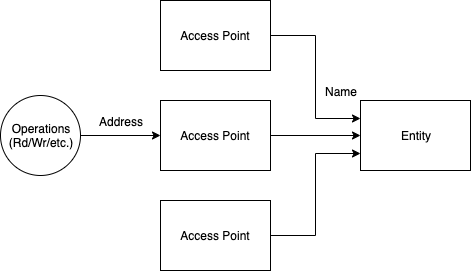
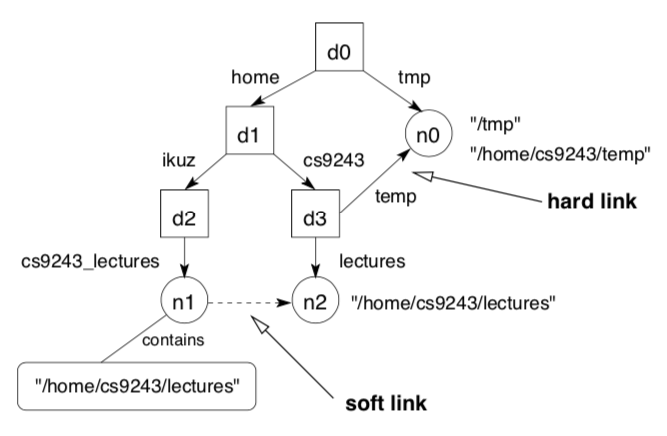
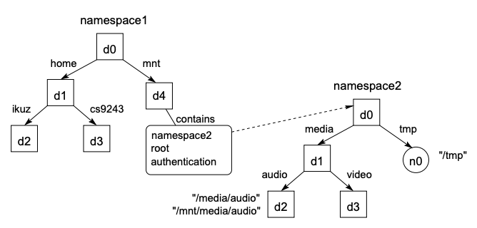

# Naming <!-- omit in toc -->

- [Basic Concepts](#basic-concepts)
  - [Terminology](#terminology)
- [Name Spaces](#name-spaces)
  - [Hierarchical Name Space](#hierarchical-name-space)
  - [Merging Name Spaces](#merging-name-spaces)
- [Name Resolution](#name-resolution)
- [Naming Services](#naming-services)
- [Attribute Based Naming (aka Directory Services)](#attribute-based-naming-aka-directory-services)
- [Distributed Hash Tables](#distributed-hash-tables)

## Basic Concepts

_Naming_ is used to identify _entities_ in systems.
An example of this is the Unix file system - it treats all entities as a file, names them accordingly and allows access through the file interface.
The difficult parts of naming include:

- _Collisions_: having the same name on different devices becomes a problem.
  Need to implement a global system to name entities.
- _Lookups_: once an entity is named, how do you find it?

### Terminology

- _Entity_: a resource, user or process in the system.
- _Name_: a string of bits or characters that refer to an identity.
- _Access point_: a location where operations on an entity can be performed.
- _Address_: the name of the access point.
  A single entity can have multiple addresses.
  The set of addresses an entity has can change (i.e. be added or lost).

|         Naming Terms         |
| :--------------------------: |
|  |

- _Pure name_: a name that does not encode any entity attributes in it.
  For example, a MAC address is a pure name, as it does not provide any information on where it can be found on the network.
- _Nonpure name_: a name that does encode entity attributes.
  For example, an IP address is a pure name, as it does provide information on where it can be found.

- _Identifier_: a name that uniquely refers to an entity.
  An entity can have one identifier, and an identifier can refer to one entity.
  It can never be reused.
  This allows for easy comparison of two entities - if they have the same identifier, they are the same entity.
- _Pure identifier_: a pure name that is also an identifier.
- _Location independent identifier_: an identifier that does not change if the entity is moved.
  It follows that a pure identifier is also a location independent identifier (but not the other way round).
- _Alias_: another name for an entity.

- _Human-orientated names_: variable length character strings.
  - Ideally pure and are often not identifiers (for example, symbolic links).
  - Often chosen for their mnemonic value.
  - Often have a structure to them.
  - Hard for machines to process, easy for humans to remember.
    Therefore, it is referred to once to get the system-orientated name, which is used from then on.
  - _Example_: a URL
- _System-orientated names_: fixed size numeral (machine-readable).
  - Ideally nonpure to speed up access time and manipulation.
  - Typically _structured_ or _unstructured_ identifiers, depending on if they are referenced in a global or local scope.
    A structured identifier is not pure.
  - To create a globally unique name, you can have either a _global generator_ (which is bad for scalability), or a structured name.
    An example of a structured name could be combining the local time and a unique machine identifier.
  - _Example_: an inode

## Name Spaces

_Name space_: a group of names which follow the same naming scheme.
All name spaces have a _leaf node_, which represents a named entity and may refer to either the entity itself or the address of it.

Name spaces can have different structures, including:

- _Flat_: name space contains only leaf nodes.
  For example, protocol name spaces (e.g. TCP, IP, ...).
- _Hierarchical_: strict, DAGs or multiple root nodes.
  This structure is commonly used because it is scalable.
- _Tag-based_

### Hierarchical Name Space

In a hierarchical name space, a leaf node has only incoming edges.
Furthermore, there are two more types of nodes used:

- _Directory node_: (aka _context_) stores information on a collection of other directory nodes or leaf nodes.
  The information is stored in a _directory table_.
  An entry to the table looks like: _(node -- id, edge -- label)_, meaning a node with _id_ can be found with along the edge named _label_.
  A directory node can have both incoming and outgoing edges.
- _Root node_: a directory node that has only outgoing edges.

A _strictly hierarchical name space_ has only one incoming edge for each node, while a _DAG_ name space can have multiple incoming edges and multiple root nodes.
A DAG has two additional types of links:

- _Hard link_: a second (or more) path that leads to an entity.
- _Soft link_: a leaf node that contains the absolute path name to another node.

|          Hard and Soft Links           |
| :------------------------------------: |
|  |

### Merging Name Spaces

Ideally want a single, global name space, but we often run into the problem where a name space has to be combined into a larger name space.
_Merging_ name spaces can be done in two ways:

- _Combining_: create a new name that combines other name spaces.
  Must sacrifice location transparency to achieve this.
  For example, turning the _~cs9243/_ directory into a global context requires you to add a URL to it: _http://www.cse.unsw.edu.au/~cs9243/naming-slides.ps_.
  This tells the client where the directory is stored, and therefore loses its location transparency.
- _Mounting_: access the namespace via a _mount point_ - a directory node that stores the information to a directory node in another name space.
  To achieve this, you need many things, including: a protocol, server, path name, authentication and authorisation info, keys for secure communication, etc.

|         Mounting Name Spaces         |
| :----------------------------------: |
|  |

## Name Resolution

## Naming Services

- Attribute-based naming example: pizza as an attribute
- Can look up pizza and get results from there

## Attribute Based Naming (aka Directory Services)

## Distributed Hash Tables
