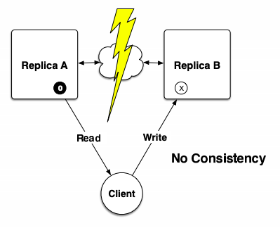
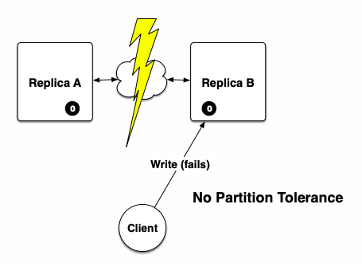
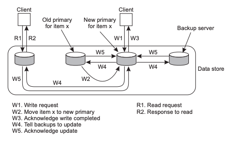
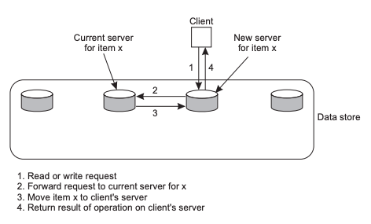
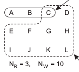
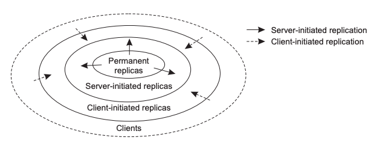

# Replication & Consistency <!-- omit in toc -->

## Table of Contents

- [Table of Contents](#table-of-contents)
- [Replication](#replication)
  - [Distributed Data Store](#distributed-data-store)
- [Consistency](#consistency)
  - [Consistency and Replication Trade-Offs](#consistency-and-replication-trade-offs)
- [Data-Centric Consistency](#data-centric-consistency)
  - [Strict consistency](#strict-consistency)
  - [Linear consistency](#linear-consistency)
  - [Sequential consistency](#sequential-consistency)
  - [Causal consistency](#causal-consistency)
  - [FIFO (PRAM) Consistency](#fifo-pram-consistency)
  - [Weak Consistency](#weak-consistency)
  - [Release Consistency](#release-consistency)
  - [Entry Consistency](#entry-consistency)
  - [Eventual Consistency](#eventual-consistency)
- [CAP Theory](#cap-theory)
- [Client-Centric Consistency](#client-centric-consistency)
  - [Monotonic Reads](#monotonic-reads)
  - [Monotonic Writes](#monotonic-writes)
  - [Read Your Writes](#read-your-writes)
  - [Write Your Reads](#write-your-reads)
- [Consistency Protocols](#consistency-protocols)
  - [Single-Server Protocol](#single-server-protocol)
  - [Primary-Backup Protocol](#primary-backup-protocol)
  - [Local-Write Protocols](#local-write-protocols)
  - [Active Replication Protocol](#active-replication-protocol)
  - [Quorum-Based Protocol](#quorum-based-protocol)
- [Update Propagation](#update-propagation)
- [Replica Placement](#replica-placement)

## Replication

It's a good idea to replicate services on multiple machines in distributed systems.
Why? There are three reasons:

- It improves _reliability_ - having redundant parts decreases the risk of one failed part screwing up your entire system.
- Replicating services means you have more processing power, hence increasing _performance_.
- Replication reduces the workload on individual servers, increasing _scalability_ in size.
  Replicating services in strategic geographical areas reduces network latency, and increases scalability in geography.

There are two forms of replication: data and control replication.

_Data replication_ involves either mirroring or caching data.
_Mirroring_ is where the disk storage is copied to other servers (for example, FTP server replication).

_Caching_ is where the data served is stored by intermediate nodes.
In general, the service providers control mirrored servers, and network providers and clients control caching.
Servers push updates to its mirrors, while caches pull updates from servers.

|                  Mirroring                  |                 Caching                 |
| :-----------------------------------------: | :-------------------------------------: |
|  |  |

_Control replication_ is horizontal scaling - replicating the services a machine provides.

**The biggest issue in replication is propagating updates.**
Reads and writes must be synchronised between nodes.

**[top](#table-of-contents)**

### Distributed Data Store

Distributed data stores use data replication to achieve high reliability, performance and scalability.
Each replica contains a _replica manager_ that is in charge of ensuring data consistency and propagating updates.

|            Distributed Data Store             |
| :-------------------------------------------: |
|  |

Clients will always be connected to one replica at a time.
A client will be able to do a read or write operation on the data store.
Operations are not instantaneous:

- _Time of issue_: when a client sends a request to the store.
- _Time of execution_: when a request is executed by a replica.
- _Time of completion_: when all replicas have been notified of the request and a reply is returned to the client.

**[top](#table-of-contents)**

## Consistency

Consistency requires two things:

- _Timing_: how old is the data allowed to be?
- _Operation Ordering_: in what order were operations performed, relative to the client?

```
! REMEMBER !

Data coherence is the order of operations for a single data item.
Data consistency is the order of operations for the entire data store.
```

Time consistency can be ensured through _versioning_.
Stale data will eventually become up to date, given enough time.
It's up to the system designer to determine how long data can be stale for.
For example, caches should not be allowed to store stale data for long, and therefore should aim to have the most up-to-date version of the data.
In general, time consistency is not a big issue.

Order consistency is more difficult to ensure, as **replicas can create conflicting operations**.
Operation ordering can have _strong order_ or _weak order_.
Strong order is where all writes are performed in the order they appear in.
This usually requires a global clock, so it's practically impossible to implement.
Weak order is where groups of writes are performed in a specific order.
Members of a group can be unordered, making it easier to implement.

A sequence of events on a replica is a _partial order_.
Combining all the partial orders creates a _total order_ - a consistent, single time frame.
It is possible to have many valid total orders, as there are many ways to solve conflicting operations.
Fortunately, _consistency models_ can help with choosing a total order by defining the characteristics one should have.
Consistency models are either _data-centric_ or _client-centric_.
It's up to the system designer to choose which consistency model to use.

**[top](#table-of-contents)**

### Consistency and Replication Trade-Offs

All consistency models have trade-offs with the properties replication try to provide:

- _Reliability_: maintaining reliability means having strong consistency: all replicas must have the full state at any given time.
  Weaker consistency means reduced reliability.
- _Performance_: having consistency means more network communication, which is a hinderance to performance.
  The weaker the consistency model, the less communication is required, so performance and consistency have an inverse relationship.
- _Scalability_: consistency model should avoid a central replica and minimise communication to be scalable.

**[top](#table-of-contents)**

## Data-Centric Consistency

### Strict consistency

**Any read returns the most recent write**.

Strict consistency requires an absolute time ordering.
As a result, it requires a global clock and instantaneous communication, making it impossible to implement in a distributed system.

**[top](#table-of-contents)**

### Linear consistency

**Operations are ordered according to a global timestamp**.

Linear consistency uses a global timestamp to order events.
All events are done in the same order, although instantaneous network communication is not required.
Requires a global clock, making it impossible to implement practically.

**[top](#table-of-contents)**

### Sequential consistency

**Clients see write operations in the same order**.

Write operations can be done in any order, as long as they are consistent between all clients - this allows for many valid total orderings.
Sequential consistency does not require a global timestamp, making it possible to implement.
It's possible to optimise communication for either reads or writes, but not both.
This results in a performance limitation of the other (read or write).

|            Sequential Consistency             |
| :-------------------------------------------: |
|  |

**[top](#table-of-contents)**

### Causal consistency

**Causally related writes are stored in order**.

Two operations are _causally related_ if one operation had to have happened before the other.
There are two cases for casual relation to occur:

- A read must happen before a write on the same client.
  For example, R(x)a must happen before W(x)b to make logical sense.
- A write must happen before a read on different clients.
  For example, W(x)c must happen before R(x)c to make logical sense.

|          Causal Consistency           |
| :-----------------------------------: |
|  |

Causal consistency provides stronger consistency than other models, while being practical to achieve.
Furthermore, it can survive network partitioning
As a result, it is one of the most common consistency models used in practice.

**[top](#table-of-contents)**

### FIFO (PRAM) Consistency

**Program order is maintained**.

Only the writes on each client is consistent.
This will create discrepancies between clients, as no total order is enforced.

**[top](#table-of-contents)**

### Weak Consistency

**Guarantees consistency after a _synchronise()_ operation**.

When a _synchronise()_ operation occurs, groups of write operations are propagated to all other nodes as updates.
Updates are organised in sequential order between the nodes.
Once all the updates have been accounted for, read/write operations can continue.

**[top](#table-of-contents)**

### Release Consistency

**\*Uses _acquire()_ and _release()_ to synchronise operations**.

Use _acquire()_ to collect updates from other nodes and _release()_ to send updates to other nodes.
All operations between acquire and release define the critical region.
Operations are only FIFO consistent, as a node can acquire updates in any order, therefore consistency between nodes is not guaranteed.

As updates are sent to all nodes on release, a node that does not acquire regularly will have their message queue filled.
A solution to this is using _lazy release_ consistency.
Here, acquire will ask each node for its latest update.
This reduces network traffic and does not fill up message queues unnecessarily.

**[top](#table-of-contents)**

### Entry Consistency

**Synchronisation attached to shared objects**.

Can use _acquire()_ and _release()_ (as RMI calls) to access object.
Object itself is not sent over the network, only synchronisation primitives.
If the node who owns the object crashes, or if there is a network partition, the object cannot be accessed.

**[top](#table-of-contents)**

### Eventual Consistency

**Given no updates, all replicas will eventually have the same data**.

For this to work, a small amount of read-write conflicts and even less write-write conflicts are tolerated.
Works well in a single writer, multiple readers scenario.
Client has to accept some level of time inconsistency.
An example of where this is implemented is with _DNS_ - changes to a record will take time to update, but it will reach eventual consistency.

**[top](#table-of-contents)**

## CAP Theory

You can only have two of the three properties:

- _Consistency_: data remains consistent (up to linear consistency).
- _Accessibility_: more than one replica can be accessed.
- _Partition Tolerance_: can survive part of a network going down.

**Proof**: Say you are reading from one replica and writing to another. If a network partition occurs between them, you have three choices:

- _AP_: Access to both replicas are maintained, but your writes won't propagate to the other replica.
- _CP_: Access to one replica is lost, but consistency is maintained as there is only one replica to write to.
- _CA_: Access to both replicas are maintained, but data becomes read-only (i.e. not writes allowed) to maintain consistency.

|              AP               |              CP               |              CA               |
| :---------------------------: | :---------------------------: | :---------------------------: |
|  |  |  |

In general, we want partition tolerance, so it becomes a choice between consistency and accessibility.
If we assume network partitions are short, then we can have accessibility, partition tolerance and eventual consistency without breaking the CAP theory.

**[top](#table-of-contents)**

## Client-Centric Consistency

Client-centric consistency provides session guarantees for a client.
We assume a single client is moving, so it will be in contact with a different replica at any given time.
Furthermore, it is assumed that the client will have more reads than writes, and **zero concurrent writes**.
Because of this, we can use eventual consistency as the basis for all client-centric models.
Client-centric models can only be used in the special case where there are no simultaneous updates to the data store.

**[top](#table-of-contents)**

### Monotonic Reads

**Client never sees an older version of the data**.

If a client reads data at time _t_, the client should never see data written before _t_.
Replica needs to collect the write set up to the last client read (i.e. at time _t_) before the next client read.
This allows for stale data to be read if the write set has not propagated to all replicas.
This is good for when the client is purely reading.
For example, reading an email from different replicas

**[top](#table-of-contents)**

### Monotonic Writes

**Write sets are propagated before the next write**.

Most recent write set for each replica must be collected before the next write.
Similar to FIFO consistency, but for a single client.
This is good for when the client is purely writing.
For example, writing to a file using different replicas.

**[top](#table-of-contents)**

### Read Your Writes

**The most recent write will be seen by the next read**.

Replicas are guaranteed to have the write set of all nodes before the next client read.
For example, sending an email and reading from it.

**[top](#table-of-contents)**

### Write Your Reads

**The next write will use the last value read by the client**.

Replicas are guaranteed to have the write set of all nodes before the next client write.

**[top](#table-of-contents)**

## Consistency Protocols

_Consistency protocols_ are an implementation of one or more consistency models.
They come as either:

- _Primary-based protocols_: contain a centralised copy where all writes are performed.
  Obviously, this does not scale well, but it is easier to implement.
  The main advantage of using primary-based protocols is that they **provide sequential consistency**.
- _Replicated-write protocols_: writes can happen on any replica.
  This scales well but is more complex to implement and can hinder performance (due to network communication).
  Replicated-write protocols do not provide

**[top](#table-of-contents)**

### Single-Server Protocol

All writes and reads are executed at a single server (via RPC calls).
Effectively, this makes the replicas caches as opposed to mirrors.
The protocol is easy to implement, but does not provide reliability because there are no replicas.

**[top](#table-of-contents)**

### Primary-Backup Protocol

All writes are executed at a single server; reads can occur from any server (via RPC calls).
A write update blocks until it has been propagated to all replicas.
Does not scale well, but is easy to implement and provides reliability.

**[top](#table-of-contents)**

### Local-Write Protocols

_Migration protocol_: when a read or write is requested, the primary copy of the data is sent to the replica in contact with the client.
This is good for small data items with no sharing, but the data is not replicated, hence there is no reliability.
If there was sharing and many reads/writes happening on two different replicas, thrashing would occur.

_Migration-primary protocol_: when a write is requested, the primary copy of the data is sent to the replica in contact with the client.
This is good for concurrent reads, but is bad for concurrent writes, as the thrashing problem persists.
This can also provide an "offline" copy that the client can write to, and updates will propagate back once the client returns online.
The protocol also provides reliability, as the data is replicated to other servers for read requests.

|             Migration Protocol              |                 Migration Primary Protocol                  |
| :-----------------------------------------: | :---------------------------------------------------------: |
|  |  |

**[top](#table-of-contents)**

### Active Replication Protocol

Writes propagate to all replicas by a coordinator, while reads are performed locally.
Requires total ordered multicast to achieve sequential consistency.
The coordinator can add a sequence number to each write before multicast, although this leads to high overhead.
Not scalable, as there is the centralisation problem at the coordinator.

**[top](#table-of-contents)**

### Quorum-Based Protocol

For every read/write operation, the client contacts a subset of replicas, who vote (saying yes or no) to completing the operation locally.
All data has a version number attached to it, when it is modified, the version number increases.
The protocol defines the minimum number of votes an operation has to succeed, called the _read quorum_ or _write quorum_.
There are two rules the quorums have to follow:

- _Nr + Nw > N_: read + write quorums must be greater than the total number of replicas.
  This ensures the client will contact a node with the most recent data (i.e. the highest version number).
- _Nw > N/2_: at least half of the replicas must vote yes for the data to be updated.
  This ensures the next read or write will contain the most recent data.
  Furthermore, this avoids write-write conflicts.

For example, a data store has a read quorum of Nr = 3, a write quorum of Nw = 10 and N = 12.
If the client wants to read, 3 replicas must vote yes to the request.
This guarantees at least one of the replicas will have the most recent data on it.
If the client wants to write, 10 replicas must vote yest to the request.
The next time a client tries to read or write, at least one replica with the most recent data will be contacted.

|         Quorum-Based Protocol         |
| :-----------------------------------: |
|  |

Guarantees sequential consistency without a coordinator or multicast, and is possible to scale well.
Performance may not be great as there is a lot of overhead required in each voting stage.
The choice of quorum sizes depends on the expected read-write ratio and the cost of group communication.

**[top](#table-of-contents)**

## Update Propagation

Replicas need a way to propagate updates to data.

_Pull updates_ send a read request to the data store when required.
It is a good method for data that has many writes but few reads.

On the other hand, _push updates_ sends an update to all replicas when a write request occurs.
This requires the data store to keep track of all replicas - including unstable ones like browser caches.
While this ensures low staleness of data, there is a lot of overhead.
Push updates generally come as multicast or unicast.
A push update can come in the form:

- _Data push_: the updated data is propagated.
  This is only good for small data or updates that are infrequent.
- _Operation push_: the operation which lead to the updated data is propagated.
  Good for low bandwidth, as a set of operations is smaller than a large data item.
  However, this method requires more distributed power.
- _Invalidation push_: data is invalidated and the replica has to send a pull request.
  This is good for low bandwidth and frequent updates.
  However, this has to be used with a pull request to get new data.

A solution to the overhead issue in push updates are using _leases_.
_Example scenario_: a cache can request a lease from a server.
The server pushes updates to the cache until the lease expires.
If the cache wants more pushed data, it needs to get a lease from the server again.
The advantage of leases is they keep bookkeeping and push update membership manageable.

**[top](#table-of-contents)**

## Replica Placement

The placement of replicas help improve reliability and performance.
_Permanent replicas_ are maintained by the data store owner and help improve reliability by creating redundant copies.
It can be a single server, but are often implemented as a cluster of mirrors.
_Server-initiated replicas_ (edge caches) are maintained by external groups, but initiated by the data store owner.
They help improve performance by being located closer to the client.
Example of server-initiated replica hosts include CDNs (CloudFlare, Akamai).
_Client-initiated replicas_ (browser and proxy caches) are not initiated by the data store owner.
They help individual clients improve performance and accessibility.

|              Replica Placement              |
| :-----------------------------------------: |
|  |

_Dynamic placement_ involves creating and deleting replicas once a certain threshold is reached.
An example of this is the RaDaR Web Hosting service.
When a client requests data from a replica, a request tally is increase.
Once the tally reaches the request threshold, a new replica is created and the tally resets.
There are different thresholds for different actions (such as create or delete thresholds).

**[top](#table-of-contents)**
