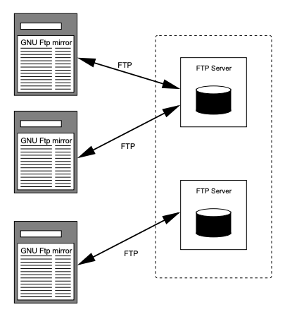
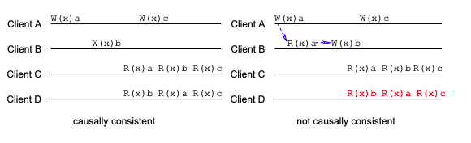

# Replication & Consistency

## Replication

It's a good idea to replicate services on multiple machines in distributed systems.
Why? There are three reasons:

- It improves _reliability_ - having redundant parts decreases the risk of one failed part screwing up your entire system.
- Replicating services means you have more processing power, hence increasing _performance_.
- Replication reduces the workload on individual servers, increasing _scalability_ in size.
  Replicating services in strategic geographical areas reduces network latency, and increases scalability in geography.

There are two forms of replication: data and control replication.

_Data replication_ involves either mirroring or caching data.
_Mirroring_ is where the disk storage is copied to other servers (for example, FTP server replication).

_Caching_ is where the data served is stored by intermediate nodes.
In general, the service providers control mirrored servers, and network providers and clients control caching.
Servers push updates to its mirrors, while caches pull updates from servers.

|                  Mirroring                  |                 Caching                 |
| :-----------------------------------------: | :-------------------------------------: |
|  |  |

_Control replication_ is horizontal scaling - replicating the services a machine provides.

**The biggest issue in replication is propagating updates.**
Reads and writes must be synchronised between nodes.

### Distributed Data Store

Distributed data stores use data replication to achieve high reliability, performance and scalability.
Each replica contains a _replica manager_ that is in charge of ensuring data consistency and propagating updates.

|            Distributed Data Store             |
| :-------------------------------------------: |
|  |

Clients will always be connected to one replica at a time.
A client will be able to do a read or write operation on the data store.
Operations are not instantaneous:

- _Time of issue_: when a client sends a request to the store.
- _Time of execution_: when a request is executed by a replica.
- _Time of completion_: when all replicas have been notified of the request and a reply is returned to the client.

## Consistency

Consistency requires two things:

- _Timing_: how old is the data allowed to be?
- _Operation Ordering_: in what order were operations performed, relative to the client?

```
! REMEMBER !

Data coherence is the order of operations for a single data item, while data consistency is the order of operations for the entire data store.
```

Time consistency can be ensured through _versioning_.
Stale data will eventually become up to date, given enough time.
It's up to the system designer to determine how long data can be stale for.
For example, caches should not be allowed to store stale data for long, and therefore should aim to have the most up-to-date version of the data.
In general, time consistency is not a big issue.

Order consistency is more difficult to ensure, as **replicas can create conflicting operations**.
Operation ordering can have _strong order_ or _weak order_.
Strong order is where all writes are performed in the order they appear in.
This usually requires a global clock, so it's practically impossible to implement.
Weak order is where groups of writes are performed in a specific order.
Members of a group can be unordered, making it easier to implement.

A sequence of events on a replica is a _partial order_.
Combining all the partial orders creates a _total order_ - a consistent, single time frame.
It is possible to have many valid total orders, as there are many ways to solve conflicting operations.
Fortunately, _consistency models_ can help with choosing a total order by defining the characteristics one should have.
Consistency models are either _data-centric_ or _client-centric_.
It's up to the system designer to choose which consistency model to use.

### Strict consistency

**Any read returns the most recent write**.

Strict consistency requires an absolute time ordering.
As a result, it requires a global clock and instantaneous communication, making it impossible to implement in a distributed system.

### Linear consistency

**Operations are ordered according to a global timestamp**.

Linear consistency uses a global timestamp to order events.
All events are done in the same order, although instantaneous network communication is not required.
Requires a global clock, making it impossible to implement practically.

### Sequential consistency

**Clients see write operations in the same order**.

Write operations can be done in any order, as long as they are consistent between all clients - this allows for many valid total orderings.
Sequential consistency does not require a global timestamp, making it possible to implement.
It's possible to optimise communication for either reads or writes, but not both.
This results in a performance limitation of the other (read or write).

|            Sequential Consistency             |
| :-------------------------------------------: |
|  |

### Causal consistency

**Causally related writes are stored in order**.

Two operations are _causally related_ if one operation had to have happened before the other.
There are two cases for casual relation to occur:

- A read must happen before a write on the same client.
  For example, R(x)a must happen before W(x)b to make logical sense.
- A write must happen before a read on different clients.
  For example, W(x)c must happen before R(x)c to make logical sense.

|          Causal Consistency           |
| :-----------------------------------: |
|  |

Causal consistency provides stronger consistency than other models, while being practical to achieve.
Furthermore, it can survive network partitioning
As a result, it is one of the most common consistency models used in practice.

### FIFO (PRAM) Consistency

**Program order is maintained**.

Only the writes on each client is consistent.
This will create discrepancy