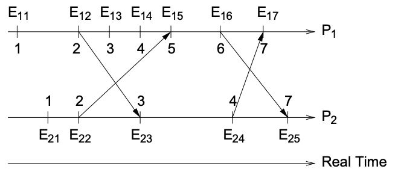

# Synchronisation and Communication

## Distributed Algorithms

_Distributed algorithms_ are either required by or used to achieve synchronisation and coordination between nodes.
Distributed algorithms are have either asynchronous or synchronous timing.
Timing is affected by clock drift, communication delays and execution speed, but we can't control these.

Key properties every distributed algorithm should have:

- _Safety_: nothing bad should happen.
  I.e. an algorithm shouldn't have any side effects if it fails.
- _Liveness_: something good will eventually happen.
- _Properties of a distributed system_: want efficiency, high performance, scalable and reliable properties

### Synchronous Distributed Algorithms

_Synchronous distributed algorithms_ have a **bounded time variance** - minimum and maximum time for clock drift, communication delay and execution speed.
Therefore, we can use timeouts to detect failure.
However, because of the maximum time restriction, synchronous DA's are not very scalable.
The benefits and drawbacks of using synchronous distributed systems are:

| Benefits                                              | Drawbacks                                                                      |
| ----------------------------------------------------- | ------------------------------------------------------------------------------ |
| _Algorithmic complexity_: algorithms are less complex | _Thread limit_: can't spawn lots of threads (max. time restriction)            |
|                                                       | _Network restriction_: need to limit network usage (max. time restriction)     |
|                                                       | _Clocks_: drift must be very low or synchronised often (max. time restriction) |
|                                                       | _Communication complexity_: communication is more complex                      |

### Asynchronous Distributed Algorithms

_Asynchronous distributed algorithms_ have an **unbounded time variance** - can't rely on timeouts to detect failure.
The benefits and drawbacks of using asynchronous distributed systems are:

| Benefits                                                                                        | Drawbacks                                                                                     |
| ----------------------------------------------------------------------------------------------- | --------------------------------------------------------------------------------------------- |
| _Communication complexity_: communication is less complex                                       | _Thread limit_: can't spawn lots of threads, as there is a maximum execution time to maintain |
| _Synchronous solutions_: finding an asynchronous solutions also provides a synchronous solution | _Algorithmic complexity_: algorithms are more complex and are hard to solve                   |

### Synchronisation and Coordination

_Coordination_: doing the right operations.
Need to agree on what actions will occur by whom.
_Synchronisation_: doing operations at the right time.
Need to have a total order of events, instructions and communication.
Main issues with synchronisation and coordination:

- Time and clocks
- Maintaining a global state
- Concurrency control

## Time and Clocks

There is no such thing as _absolute time_.
Clocks on different computers will always drift away from each at different rates.
_Astronomical time_ is not stable - the length of one day changes.
_International Atomic Time (IAT)_ is the most stable time source we have.

_Coordinated Universal Time (UTC))_: based on IAT and tries to dynamically calculate time by adding leap seconds.
UTC is broadcasted over the world through time servers.
Synchronisation and coordination can be based on either _physical clocks_ (based on an actual time source) or _logical clocks_.

### Physical Clocks

_Physical clocks_: use UTC time to synchronise and coordinate operations.
$$C_p(t)$$ is the current UTC time on machine $$p$$.
Machine $$p$$ must synchronise with UTC often as drift will occur.
Synchronisation between computers can occur _internally_ (between computers) or _externally_ (with a time server).

_Berkley algorithm_: each computer has a time daemon which they poll for a time.
Time daemons poll a leader node for the time.
The leader node moves the average of the time differences between all the nodes, then replies with how much to move the clock by (including the leader node itself).
Leaders can change when one goes down.
The benefits and drawbacks of using the Berkley algorithm are:

| Benefits               | Drawbacks                                   |
| ---------------------- | ------------------------------------------- |
| _Pure synchronisation_ | _Scalability_: only good for LAN            |
| _Low latency networks_ | _Time_: doesn't provide the actual UTC time |
|                        | _Accuracy_: low accuracy of 20-25ms         |

|              Berkley Algorithm              |
| :-----------------------------------------: |
|  |

_Cristian’s algorithm_: clients query a UTC time server.
Accounting for network delays and interrupt handling, the client slows down or speeds up the time until it is synchronised with the time server.
The benefits and drawbacks of using Cristian's algorithm are:

| Benefits                                     | Drawbacks                                           |
| -------------------------------------------- | --------------------------------------------------- |
| _Complexity_: simple to implement            | _Scalability_: relies on client-server architecture |
| _Accuracy_: high accuracy of 1-10ms (in LAN) |                                                     |

_Network Time Protocol (NTP)_: uses a hierarchy of time servers, clients synchronise with the time servers.
This means NTP can be used in WAN, as there is no centralisation.
NTP has a large accuracy range, from 1-50ms.
There are many ways to synchronise time in NTP:

- _Multicast_: good for LAN or low latency.
- _RPC_: client's poll the server time, then adjust for network communication.
  This has reasonable accuracy.
- _Symmetric communication_: between peer time servers.
  This has the highest accuracy.

### Logical Clocks

_Logical clocks_: determining event ordering, as opposed to events at relative to some time.
Use the _happened before_ operator: $$a → b$$ (a happened before b).
$$a → b$$ means that:

- $$a$$ occurred before $$b$$ on the same machine (maintaining program order).
- $$a$$ was a message sent and $$b$$ was the message received on another process.
- $$a$$ and $$b$$ are on separate processes but are transitively related by the other two reasons.

Events that do not have a $$→$$ relation are _concurrent_: $$a \| b$$ (a is concurrent to b).

_Lamport clocks_: clocks that determine the causal ordering of events.
Used compute the $$→$$ relation.
A clock on machine $$i$$ is referred to as $$L_i$$.

**Implementation**:

1. Before executing a local event, timestamp it with $$L_i := L_i + 1$$.
2. When a message $$m$$ is sent from machine $$i$$ to $$j$$:
   - $$i$$ updates it's timestamp and sends $$L_i$$ along with $$m$$.
   - $$j$$ receives $$L_i$$ with $$m$$ and updates it's timestamp to $$L_j := max(L_j, L_i) + 1$$.

The timestamp of event $$a$$ on machine $$i$$is $$L_i(a)$$.
If $$L_i(a) < L_i(b)$$, we know with certainty that:

- either $$a → b$$ or $$a \| b $$
- b did not happen before a

The drawback of using Lamport clocks is that it does not provide a single, causally related total ordering.

|                  Lamport Clock Example                  |
| :-----------------------------------------------------: |
|  |

In this example, the total order is: $$(11 \|/→ 21) → (12 \|/→ 22) → (13 \|/→ 23) → 14 → 15 → (16 \|/→ 24) → (17 \|/→ 27)$$.
Some operations can be concurrent or happened before, but we are not sure.

_Vector clocks_: solves the concurrency problem in Lamport clocks by maintaining a clock for each computer.
A clock $$V_i$$ is an array on machine $$i$$ that has a length of $$N$$ machines.
$$V_i[j]$$ is machine $$j$$ clock stored on machine $$i$$.
I.e. the time of the last received message on machine $$j$$.

**Implementation**:

1. Initially, $$V_i[j] := 0$$ for $$i,j∈{1,...,N}$$.
2. Before executing a local event, timestamp it with $$V_i[i] := V_i[i] + 1$$.
3. When a message $$m$$ is sent from machine $$i$$ to $$j$$:

   - $$i$$ updates it's timestamp and sends $$V_i$$ along with $$m$$.
   - $$j$$ receives $$V_i$$ with $$m$$ and merges the vector clocks to:

   $$
      V_j[k] := \left\{
      \begin{array}{ll}
          max(V_j[k], V_i[k]) + 1 \qquad \ if \ j=k \\
          max(V_j[k], V_i[k]) \qquad \qquad otherwise
      \end{array}
       \right.
   $$

We know with certainty that for events $$a$$ and $$b$$, which have a vector clock stamp of $$V(a)$$ and $$V(b)$$:

- $$a → b$$ iff:

  - $$V(a)[k] \leq V(b)[k]$$ for all $$k∈{1,...,N}$$.
    I.e. all elements of $$V(a)$$ are less than/equal all elements in $$V(b)$$.
  - $$V(a)[k] < V(b)[k]$$ for at least one $$k∈{1,...,N}$$.
    I.e. at least one element in $$V(a)$$ at position $$k$$ is less than the element in the same position in $$V(b)$$.

- $$a \| b$$ iff $$V(a)[k] \ngeq V(b)[k] \land V(a)[k] \ngeq V(b)[k]$$ for all $$k∈{1,...,N}$$.
  I.e. if at least one element in $$V(a)$$ is less than an element in $$V(b)$$ and vice versa, a is concurrent to b.

|                 Vector Clock Example                  |
| :---------------------------------------------------: |
|  |

In this example, $$E_{31}$$ happened before $$E_{24}$$ as all elements in $$E_{31}$$ are less than/equal to the elements in $$E_{24}$$ and $$E_{31}[0] < E_{24}[0]$$.
$$V(E_{11})$$ and $$V(E_{12})$$ occurred concurrently as $$V(E_{11})[0] > V(E_{12})[0]$$ and $$E_12[1] > E11[1]$$.

The total order is: $$(11\|21\|31) → (12\|32) → (22 → 23 → 24 → 13) \| 32$$.
We are able to tell what which operations are concurrent with certainty.

## Global State

Global properties include
Objects not being used (for garbage collection)
Deadlock detection

## Concurrency Control

FIFO multicast - attach a sequence number to every message → ensures messages are in order for every sender
Causal multicast - messages are causally ordered
Totally ordered multicast:
Sequencer - sequencer reorders messages and sends it out again
