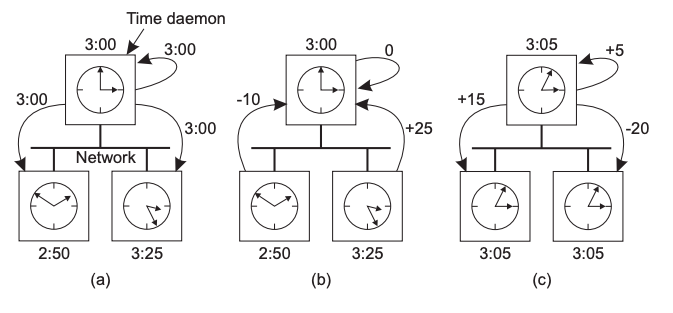
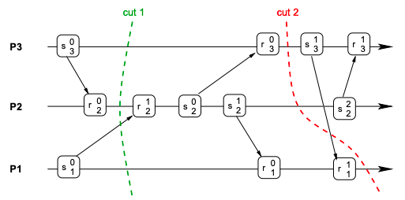
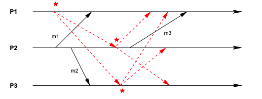
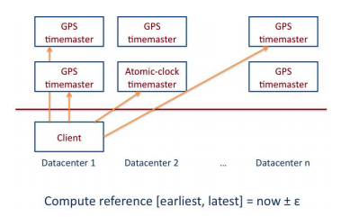
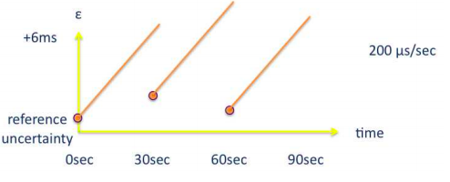
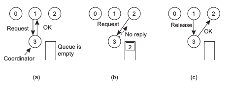
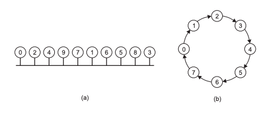
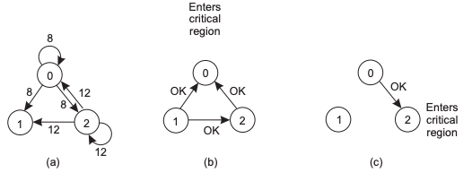

# Synchronisation and Coordination <!-- omit in toc -->

# Table of Contents <!-- omit in toc -->

- [Synchronisation and Coordination](#synchronisation-and-coordination)
- [Time and Clocks](#time-and-clocks)
  - [Physical Clocks](#physical-clocks)
    - [Berkley Algorithm](#berkley-algorithm)
    - [Cristian's Algorithm](#cristians-algorithm)
    - [Network Time Protocol](#network-time-protocol)
  - [Logical Clocks](#logical-clocks)
    - [Lamport Clocks](#lamport-clocks)
    - [Vector Clocks](#vector-clocks)
- [Global State](#global-state)
  - [Consistent Cuts](#consistent-cuts)
    - [Terminology](#terminology)
    - [Cuts](#cuts)
  - [Chandy and Lamport Snapshots](#chandy-and-lamport-snapshots)
  - [Example: Spanner and TrueTime](#example-spanner-and-truetime)
    - [Spanner](#spanner)
    - [TrueTime](#truetime)
- [Concurrency](#concurrency)
  - [Central Server](#central-server)
  - [Token Ring](#token-ring)
  - [Multicast and Logical Clocks](#multicast-and-logical-clocks)
- [Transactions](#transactions)
- [Elections](#elections)
- [Multicast](#multicast)

# Synchronisation and Coordination

_Coordination_: doing the **right operations**.
Need to agree on what actions will occur by whom.

_Synchronisation_: doing operations at the **right time**.
Need to have a total order of events, instructions and communication.

Main issues with synchronisation and coordination:

- Time and clocks
- Maintaining a global state
- Concurrency control

# Time and Clocks

There is no such thing as _absolute time_.
Clocks on different computers will always drift away from each at different rates.

_Astronomical time_ is not stable - the length of one day changes.

_International Atomic Time (IAT)_ is the most stable time source we have.

_Coordinated Universal Time (UTC))_: based on IAT and tries to dynamically calculate time by adding leap seconds.
UTC is broadcasted over the world through time servers.

Synchronisation and coordination can be based on either _physical clocks_ or _logical clocks_.

## Physical Clocks

_Physical clocks_: use UTC time to synchronise and coordinate operations.

_$$C_p(t)$$_ is the current UTC time on machine $$p$$.
Machine $$p$$ must synchronise with UTC often, otherwise drift will occur.

Synchronisation between computers can occur _internally_ (between computers) or _externally_ (with a time server).

### Berkley Algorithm

_Berkley algorithm_: each computer has a time daemon which they poll for a time.
Time daemons poll a leader node for the time.
The leader node moves the average of the time differences between all the nodes, then replies with how much to move the clock by (including the leader node itself).
Leaders can change when one goes down.

The benefits and drawbacks of using the Berkley algorithm are:

| Benefits               | Drawbacks                                   |
| ---------------------- | ------------------------------------------- |
| _Pure synchronisation_ | _Scalability_: only good for LAN            |
| _Low latency networks_ | _Time_: doesn't provide the actual UTC time |
|                        | _Accuracy_: low accuracy of 20-25ms         |

|              Berkley Algorithm              |
| :-----------------------------------------: |
|  |

### Cristian's Algorithm

_Cristian’s algorithm_: clients query a UTC time server.
Accounting for network delays and interrupt handling, the client slows down or speeds up the time until it is synchronised with the time server.

The benefits and drawbacks of using Cristian's algorithm are:

| Benefits                                     | Drawbacks                                           |
| -------------------------------------------- | --------------------------------------------------- |
| _Complexity_: simple to implement            | _Scalability_: relies on client-server architecture |
| _Accuracy_: high accuracy of 1-10ms (in LAN) |                                                     |

### Network Time Protocol

_Network Time Protocol (NTP)_: uses a hierarchy of time servers, clients synchronise with the time servers.
This means NTP can be used in WAN, as there is no centralisation.
NTP has a large accuracy range, from 1-50ms.
There are many ways to synchronise time in NTP:

- _Multicast_: good for LAN or low latency.
- _RPC_: client's poll the server time, then adjust for network communication.
  This has reasonable accuracy.
- _Symmetric communication_: between peer time servers.
  This has the highest accuracy.

## Logical Clocks

_Logical clocks_: determining event ordering, as opposed to events at relative to some time.

Use the _happened before_ operator: $$a → b$$ (a happened before b).
_$$a → b$$_ means that:

- _$$a$$_ occurred before $$b$$ on the same machine (maintaining program order).
- **_$$a$$_ was a message sent and $$b$$ was the message received on another process.**
- _$$a$$_ and $$b$$ are on separate processes but are transitively related by the other two reasons.

Events that do not have a $$→$$ relation are _concurrent_: $$a \| b$$ (a is concurrent to b).

### Lamport Clocks

_Lamport clocks_: logical clock that shows the last event seen on a node.
Determine the causal ordering of events (i.e. used compute the $$→$$ relation).
A Lamport clock on machine $$i$$ is referred to as $$L_i$$.

**Implementation**:

1. Before executing a local event, timestamp it with $$L_i := L_i + 1$$.
2. When a message $$m$$ is sent from machine $$i$$ to $$j$$:
   - _$$i$$_ updates it's timestamp and sends $$L_i$$ along with $$m$$.
   - _$$j$$_ receives $$L_i$$ with $$m$$ and updates it's timestamp to $$L_j := max(L_j, L_i) + 1$$.

The timestamp of event $$a$$ on machine $$i$$ is $$L_i(a)$$.
If $$L_i(a) < L_i(b)$$, we know with certainty that:

- either $$a → b$$ or $$a \| b$$
- b did not happen before a

The drawback of using Lamport clocks is that it does not provide a single, causally related total ordering.

|                  Lamport Clock Example                  |
| :-----------------------------------------------------: |
|  |

In this example, the total order is: $$(11 \|/→ 21) → (12 \|/→ 22) → (13 \|/→ 23) → 14 → 15 → (16 \|/→ 24) → (17 \|/→ 27)$$.
Some operations can be concurrent or happened before, but we are not sure.

### Vector Clocks

_Vector clocks_: solves the concurrency problem in Lamport clocks by maintaining a clock for each computer.
A clock $$V_i$$ is an array on machine $$i$$ that has a length of $$N$$ machines.
_$$V_i[j]$$_ is machine $$j$$ clock stored on machine $$i$$.
I.e. the time of the last received message on machine $$j$$.

**Implementation**:

1. Initially, $$V_i[j] := 0$$ for $$i,j∈{1,...,N}$$.
2. Before executing a local event, timestamp it with $$V_i[i] := V_i[i] + 1$$.
3. When a message $$m$$ is sent from machine $$i$$ to $$j$$:

   - _$$i$$_ updates it's timestamp and sends $$V_i$$ along with $$m$$.
   - _$$j$$_ receives $$V_i$$ with $$m$$ and merges the vector clocks to:

   $$
      V_j[k] := \left\{
      \begin{array}{ll}
          max(V_j[k], V_i[k]) + 1 \qquad \ if \ j=k \\
          max(V_j[k], V_i[k]) \qquad \qquad otherwise
      \end{array}
       \right.
   $$

We know with certainty that for events $$a$$ and $$b$$, which have a vector clock stamp of $$V(a)$$ and $$V(b)$$:

- _$$a → b$$_ iff:

  - _$$V(a)[k] \leq V(b)[k]$$_ for all $$k∈{1,...,N}$$.
    I.e. all elements of $$V(a)$$ are less than/equal all elements in $$V(b)$$.
  - _$$V(a)[k] < V(b)[k]$$_ for at least one $$k∈{1,...,N}$$.
    I.e. at least one element in $$V(a)$$ at position $$k$$ is less than the element in the same position in $$V(b)$$.

- _$$a \| b$$_ iff $$V(a)[k] \ngeq V(b)[k] \land V(a)[k] \ngeq V(b)[k]$$ for all $$k∈{1,...,N}$$.
  I.e. if at least one element in $$V(a)$$ is less than an element in $$V(b)$$ and vice versa, a is concurrent to b.

|                 Vector Clock Example                  |
| :---------------------------------------------------: |
|  |

In this example, $$E_{31}$$ happened before $$E_{24}$$ as all elements in $$E_{31}$$ are less than/equal to the elements in $$E_{24}$$ and $$E_{31}[0] < E_{24}[0]$$
. $$V(E_{11})$$ and $$V(E_{12})$$ occurred concurrently as $$V(E_{11})[0] > V(E_{12})[0]$$ and $$E_{12}[1] > E_{11}[1]\$$.

The total order is: $$(11\|21\|31) → (12\|32) → (22 → 23 → 24 → 13) \| 32$$.
We are able to tell what which operations are concurrent with certainty.

# Global State

_Global state_: a collection of _global properties_ that describe the system at a point in time.
Local information from multiple nodes are combined to create global properties.

Properties include:

- _Object references_: does an object have any references to it?
- _Locks_: what locks are currently in use?
- _Running processes_: which processes are still alive?

Useful to store these properties in a _checkpoint_ so the state of the system is saved, but must ensure all properties are consistent.

## Consistent Cuts

Information amongst nodes may not be consistent at some arbitrary time.
For example, taking information at 2pm on each node disregards messages in flight, clock skew, etc.
Need to define a criterion for what constitutes as globally consistent information.

### Terminology

_Process_: each process, $$p_i, i \in \{1,...,N\}$$, has a:

- _Event_: $$e_i^j$$ - some local operation or communication performed
- _Local history_: $$h_i^k = <e_i^0,e_i^1,...>$$ - a complete history of all events that have occurred locally.
- _State_: $$s_i^k$$ - the history of events up to $$e_i^{k-1}$$.

_Global history_: $$H := \bigcup\limits_{i=1}^{N} h_i$$ - a total order of global histories.

_Global state_: $$S := (s_1, ..., s_N)$$ - a total order of all local states.

_Cut_: $$C := \bigcup\limits_{i=1}^{N} h_i^{c_i}$$ - total order of events up to a certain point in time, _k_.
In other words, a cut is the global history at a certain point in time, $$c_i$$.

_Frontier_: the last events in a cut.

### Cuts

A cut corresponds to the global history, which is a representation of the global state.

_Consistent cut_: a cut that has no dependencies on events outside the cut.
In other words, a cut is consistent if all of its receive events have a corresponding send.

|   Consistent vs Non-consistent Cuts   |
| :-----------------------------------: |
|  |

A consistent cut creates a _consistent global state_.
A sequence of consistent global states is called a _consistent run_ or _linearisation_.

## Chandy and Lamport Snapshots

_Chandy and Lamport Snapshots_: algorithm for creating a consistent global state.

Accounts for messages in transit - don't need to wait until all messages have stopped to take a snapshot.

When complete, a process has their local state and a set of messages in transit while the snapshot was being taken.

**Assumptions**:

- Reliable communication
- Failure-free processes
- Causal ordering (all messages are received in order)
- Processes are strongly connected

**Implementation**:

1. A process takes a local snapshot by:
   - Records its local state
   - Sends a marker message to all nodes in the system
2. When a process receives a marker message:
   - If it isn't taking a snapshot, begin taking one by repeating step 1
   - Else, mark the sender as complete
3. While waiting for marker messages, a node explicitly stores all other messages (in flight messages) it has received
4. Once a marker message has been received by all nodes, the local snapshot is complete.

|          Chandy and Lamport Snapshot          |
| :-------------------------------------------: |
|  |

## Example: Spanner and TrueTime

### Spanner

_Spanner_: Google's distributed database that **uses a global clock** to ensure external (sequential) consistency.

Data is _versioned_ using a timestamp from the global clock, which can then be ordered into a global sequence.

Read operations are performed on a _snapshot_ - given a timestamp, return the nearest snapshot value $$\leq$$ to it.

- Guarantees consistency without a lock.
- Client must allow for slightly stale data, as a snapshot of the system must be taken before a (current) read.

Write operations (technically transactions) have a unique timestamp.
It's a problem if timestamps overlap, but:

- Writes are protected by a lock, so only one write is allowed at a time (per data item).
- Global time guarantees all nodes will base their timestamp from the same source.

### TrueTime

_TrueTime_: Google's global clock architecture.

Get the global time by querying a TrueTime server, `TT.now()`.

Each query has an earliest (minimum) and latest (maximum) time of the global clock could be.
Can account for clock skew by adding a delay to the transaction based on the earliest and latest global times.
Since all write transactions are in a lock, delaying the transaction ensures the timestamp will be unique.

Delaying the transaction in C:

```c
// timestamp the transaction with s
s = TT.now();

// Wait until the earliest time it can be is > the latest time the timestamp could be
while(TT.now().earliest > s.latest);
```

|             TrueTime Architecture             |             Uncertainty Synchronisation             |
| :-------------------------------------------: | :-------------------------------------------------: |
|  |  |

# Concurrency

_Concurrency control_: prevent concurrent processes accessing something at the same time.

Need to apply it correctly, otherwise you can end up with _deadlock_, _livelock_ or _starvation_.

In distributed systems, concurrency is difficult as there isn't:

- Directly shared resources
- Global state
- Centralised algorithms

Want to evaluate concurrency control algorithms as distributed algorithms.
They should also have _causal consistency_.

## Central Server

_Central server_: node requests a token from a lock server when entering critical section.
Node returns token when leaving critical section.

Properties:

| Property                     | Value                                                             |
| ---------------------------- | ----------------------------------------------------------------- |
| Number of messages exchanged | _3 messages_: request, response (from server) and release message |
| Delay (number of messages)   | _2 messages_                                                      |
| Reliability                  | _Poor_: single point of failure at server or client with token    |
| Scalability                  | _Poor_                                                            |

|               Central Server                |
| :-----------------------------------------: |
|  |

## Token Ring

_Token Ring_: constantly pass a token around a ring.
If you want to enter a critical section, wait until the token has reached you before entering.

Properties:

| Property                     | Value                                                                |
| ---------------------------- | -------------------------------------------------------------------- |
| Number of messages exchanged | _Depends_: token is always being passed around, technically infinity |
| Delay (number of messages)   | _Average N/2_: worst case is one trip around the ring - N-1 messages |
| Reliability                  | _Bad_: ring breaks if any node goes down or token is lost in transit |
| Scalability                  | _Poor_: lots of wasted bandwidth is used passing the token around    |

|               Token Ring                |
| :-------------------------------------: |
|  |

## Multicast and Logical Clocks

_Ricart & Agrawala Algorithm_: algorithm for creating decentralised concurrency control.

**Assumptions**:

- Every process has a Lamport clock and is in a strongly connected graph.
- All processes are in one of three states:
  - _Released_: not waiting or just released a lock.
  - _Wanted_: waiting for a lock to be released.
  - _Held_: currently holding a lock.

**Implementation**:

1. When a process wants to enter the critical section, multicast \$$$\langle L_i, p_i \rangle$$\$ to all nodes.
2. Process waits until all nodes have replied before entering section.
3. For a node that receives a multicast message:
   - Released: reply immediately
   - Wanted: look at Lamport clock and:
     - Reply immediately if message timestamp is smaller than own clock
     - Else, wait until Released state is reached
   - Held: wait until Released state is reached.

Properties:

- Messages sent: n-1 messages out, n-1 messages back --> 2(n-1)
- Delay is the same
- Reliability: Any node crashing will deadlock the node
- Multicast creates a lot of overhead

| Property                     | Value                                                     |
| ---------------------------- | --------------------------------------------------------- |
| Number of messages exchanged | _2(n-1)_: n-1 messages out, n-1 messages back             |
| Delay (number of messages)   | _2(n-1)_: same reason as above                            |
| Reliability                  | _Worst_: any node crashing or message lost crashes system |
| Scalability                  | _Poor_: multicast creates a lot of overhead               |

|       Multicast and Lamport Clocks        |
| :---------------------------------------: |
|  |

In this example:

a) Node 0 and Node 2 mutlicast message to other nodes with Lamport clock values of 8 and 12 respectively.
Node 0 and Node 2 are now in the _waiting_ state, while Node 1 is _released_.

b) Since Node 0 has a smaller clock value, it will receive replies from all nodes first.
Node 0 goes to the _held_ state, while Node 2 is _waiting_ and Node 1 is _released_.

c) When Node 0 exits the critical section, it sends a reply to Node 2, allowing it to enter its critical section.
Node 2 goes to the _held_ state, Node 0 and Node 1 is _released_.

# Transactions

_Transactions_: mutual exclusion++ :)

- A sequence/group of operations
- Atomic in the face of concurrency and failures - either all or nothing
- Allows multiple data items to be modified

Operations:

- Begin/end transaction
- Inbetween the begin/end, you can do reads/writes
- End transaction - decide to commit or abort

Inventory example:

- Can view old and today's tape, unmodified at any time
- Output tape can fail or break, and you can abort back to old inventory
- Can't see inside computer
- If computer succeeds, new tape is made

ACID properties - properties we are interested in for transactions

- _Atomicity_ - all or nothing
- _Consistent_ - doesn't produce inconsistent results
  - E.g. a transaction can't create/destroy money (for bank transaction example)
- _Isolated_ - operations aren't visible from the outside
- _Durable_ - results are permanent after a commit, even in failure

Types of transactions:

- Flat
- Hierarchy
- Distributed

Nested transaction failure options:

- Abort whole transaction
- Commit non-aborted transactions only
- Try alternatives to aborted part

Subtransaction can abort at any time, but can only commit when parent is ready to commit

Transaction Atomicity Implementation:

Private workspace - create a copy of the data and run the transaction on it, on commit: swap the copies of data, on abort: discard the copy

- Optimises for aborting
- Uses a lot of space

Writeahead log - run operations on original copy, on commit: do nothing, on abort: rollback

- Optimises for commit

Concurrency control - what happens when you have simultaneous transactions?

Problem 1: lost update - writing to system gives inconsistent results
Problem 2: inconsistent retrieval - accessing state of the system in the middle of a transaction gives inconsistent results

Legal schedule - want concurrent transactions to look like they are serialised

Serial equivalence: want all conflicting operations (read-write/write-write) to be in the same order on data items
E.g. R1(x) W1(x) R2(y) W2(y) R2(x) W1(y) is not serially equivalent
Conflicting operations: {W1(x), R2(x)}, {R2(y), W1(y)}, {W2(y), W1(y)}
All 1's need to be before 2's, or vice versa

    R1(x)R2(y)W2(y)R2(x)W1(x)W1(y) is serially equivalent
    All 2's are before 1's

Managing concurrency

- Locking - pessimistic approach
  - Before you do a read or write, need to get a lock for the data item
  - Requires scheduler - makes sure legal schedule is done
- 2 Phase locking - ensures serial equivalence

  - Get all the locks you need for one transaction, then release them all
  - Problems:
    - Deadlocks - try and detect it with the scheduler --> break one of the transactions. Can also have timeouts
    - Cascaded abort - can get a dirty read

- Timestamp ordering - TODO

# Elections

# Multicast

FIFO multicast - attach a sequence number to every message → ensures messages are in order for every sender
Causal multicast - messages are causally ordered
Totally ordered multicast:
Sequencer - sequencer reorders messages and sends it out again
